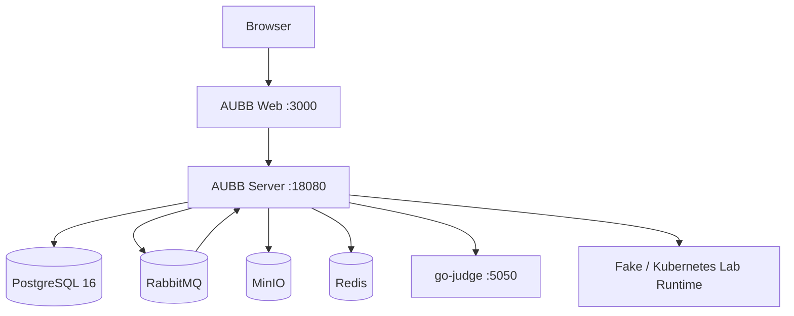

# 部署文档

## 1. 文档信息

- 文档名称：AUBB（Academic Unified Builder Bench）部署文档
- 版本：v1.3
- 状态：正式基线
- 更新日期：2026-06-12
- 适用范围：本地开发、演示环境、课程答辩环境

## 2. 部署目标与边界

本文档定义可复验的最小部署路径，回答“怎样把系统跑起来并完成验收冒烟”。详细 API、数据库表结构和测试用例分别由稳定接口清单、数据库文档和测试报告负责。

部署后至少应验证：

1. Web 前端可访问，后端健康检查通过。
2. PostgreSQL、RabbitMQ、MinIO、Redis、go-judge 等依赖可连接。
3. 管理员、教师、学员三类角色能够完成核心教学主链路。
4. 编程题试运行、正式评测、成绩发布、通知和实验入口可按配置工作。

## 3. 部署拓扑



## 4. 运行依赖

| 类别 | 基线 |
| --- | --- |
| 后端运行时 | Java 25、Maven Wrapper、Spring Boot 4 |
| 前端运行时 | Node.js、npm、Next.js 16、React 19 |
| 数据库 | PostgreSQL 16 |
| 消息队列 | RabbitMQ，评测队列和 DLQ |
| 对象存储 | MinIO 或 S3 兼容服务 |
| 缓存 / 限流 | Redis 7，可按配置启用 |
| 判题服务 | `criyle/go-judge`，Linux 环境优先 |
| 实验运行时 | 本地可用 Fake Runtime；真实 Web 终端实验使用 Kubernetes Runtime |

## 5. 核心配置

| 变量 | 说明 | 示例 |
| --- | --- | --- |
| `SERVER_PORT` | 后端 API 端口 | `18080` |
| `SPRING_DATASOURCE_URL` | PostgreSQL 连接串 | `jdbc:postgresql://localhost:5432/aubb` |
| `SPRING_DATASOURCE_USERNAME` | 数据库用户名 | `aubb` |
| `SPRING_DATASOURCE_PASSWORD` | 数据库密码 | `change-me` |
| `SPRING_RABBITMQ_HOST` | RabbitMQ 地址 | `localhost` |
| `SPRING_RABBITMQ_USERNAME` | RabbitMQ 用户 | `aubb` |
| `SPRING_RABBITMQ_PASSWORD` | RabbitMQ 密码 | `change-me` |
| `AUBB_JWT_SECRET` | JWT 签名密钥 | 至少 32 字节随机值 |
| `AUBB_MINIO_ENDPOINT` | MinIO / S3 地址 | `http://localhost:9000` |
| `AUBB_MINIO_ACCESS_KEY` | 对象存储访问键 | `aubbminio` |
| `AUBB_MINIO_SECRET_KEY` | 对象存储密钥 | `change-me` |
| `AUBB_GO_JUDGE_ENABLED` | 是否启用真实 go-judge | `true` |
| `AUBB_GO_JUDGE_BASE_URL` | go-judge 地址 | `http://localhost:5050` |
| `AUBB_REDIS_ENABLED` | 是否启用 Redis 增强 | `true` / `false` |
| `AUBB_LAB_RUNTIME_MODE` | 实验运行时模式 | `fake` / `kubernetes` |

真实凭据只允许写入本地环境文件或部署环境变量，不提交到仓库。

## 6. 本地开发 / 演示部署

工作区根目录提供统一入口，优先使用以下命令：

```bash
just healthcheck
just dev-up
```

`just dev-up` 会启动本地 Docker 依赖、后端 `127.0.0.1:18080` 和前端 `127.0.0.1:3000`。如果需要停止本轮启动的服务：

```bash
just dev-down
```

启动后检查：

```bash
curl -fsS http://127.0.0.1:18080/actuator/health/readiness
curl -fsS http://127.0.0.1:3000
```

## 7. 容器依赖单独启动

需要只启动后端依赖时，在 `server/` 仓库执行：

```bash
cd server
docker compose -f compose.yaml up -d postgres rabbitmq minio redis go-judge
```

后端数据库迁移由应用启动时的 Flyway 管理。若进行发布演练，应先完成环境变量检查，再启动应用镜像或本地服务。

## 8. 初始化与验收冒烟

建议准备以下演示数据：

- 1 个平台管理员账号
- 2 个教师账号
- 4 个学员账号
- 1 门演示课程和 1 个教学班
- 1 个结构化编程作业
- 1 个报告型实验或终端实验

冒烟检查清单：

| 检查项 | 期望结果 |
| --- | --- |
| 管理员登录 | 能进入平台配置、组织、用户、审计等入口 |
| 教师课程链路 | 能创建课程、教学班、成员、公告、资源、讨论和作业 |
| 学员作业链路 | 能查看作业、进入在线 IDE、保存、试运行并提交整份作业 |
| 评测链路 | go-judge 返回评测结果，提交详情可查看报告 |
| 批改成绩链路 | 教师能批改、发布成绩，学员能查看已发布成绩 |
| 实验链路 | 报告型实验可提交报告；终端实验可按运行时配置启动会话 |
| 通知链路 | 关键事件产生站内通知，通知列表和未读数可刷新 |

## 9. 验证命令

| 目标 | 命令 |
| --- | --- |
| 三仓库状态检查 | `just status` |
| 快速非浏览器门禁 | `just verify` |
| 完整非浏览器门禁 | `just verify-full` |
| 真实本地 E2E | `just e2e-real` |
| 文档站构建 | `cd docs && npm run docs:build` |

## 10. 常见问题与排障

| 现象 | 排查方向 |
| --- | --- |
| 登录成功但页面空白 | 检查前端 API 基地址、后端端口和浏览器网络请求 |
| 后端 readiness 失败 | 检查 PostgreSQL、MinIO、go-judge、RabbitMQ 和 Redis 配置 |
| IDE 保存失败 | 检查作业状态、成员关系、工作区修订冲突和 API 日志 |
| 评测一直不结束 | 检查 RabbitMQ 队列、Consumer、DLQ 和 go-judge 状态 |
| 报告无法下载 | 检查 MinIO 连接、对象 key 和下载权限 |
| 终端实验无法连接 | 检查 `AUBB_LAB_RUNTIME_MODE`、会话状态、连接 token 和 WebSocket 请求 |
| 成绩发布后学员看不到结果 | 检查成绩发布状态、学员课程成员关系、作业范围和通知事件 |

## 11. 回滚方案

- 应用版本回滚：回退到上一个已验证镜像或源码提交。
- 数据库回滚：优先使用发布前备份恢复，不做危险的手工表级回滚。
- 对象存储回滚：按对象 key 和业务记录核对，不直接删除未知对象。
- 配置回滚：恢复上一版环境变量与平台配置，重新执行健康检查。
