# 软件详细设计说明书

## 1 引言

### 1.1 编写目的

本文档在《软件概要设计说明书》的基础上，作为 AUBB 开发启动前的详细设计基线，细化系统结构、子系统划分、功能模块、接口、界面、异常处理、性能安全与测试计划。

本文档的预期读者包括：

| 读者 | 使用目的 |
| --- | --- |
| 项目评审人员 | 检查概要设计是否被落实为可实现、可验证的详细设计 |
| 前端开发人员 | 明确页面路由、组件分层、状态管理和交互边界 |
| 后端开发人员 | 明确模块职责、应用服务、领域规则、持久化与异步任务边界 |
| 测试人员 | 根据模块、状态机、异常路径和接口边界设计测试用例 |
| 运维与实施人员 | 理解部署节点、外部依赖、故障恢复和安全要求 |

### 1.2 背景

| 项目 | 内容 |
| --- | --- |
| 软件系统名称 | AUBB（Academic Unified Builder Bench）在线教学与实训平台 |
| 任务提出者 | 北京航空航天大学软件工程课程项目要求与 AUBB 项目组 |
| 开发者 | AUBB 项目组 |
| 主要用户 | 平台管理员、教师、助教、学员、运维/客服 |
| 运行环境 | 现代 Web 浏览器、Next.js 前端服务、Spring Boot 后端服务、PostgreSQL、MinIO、RabbitMQ、Redis、go-judge |
| 开发阶段 | 开发前详细设计阶段 |

系统拟采用模块化单体后端与角色分区前端。后端以 `modules.<module>` 为业务边界，模块内部按 `api / application / domain / infrastructure` 分层；前端基于 Next.js App Router 按 `admin / teacher / student / auth` 路由组组织页面，并在业务域目录中封装 API、Hooks、Model 与组件。

### 1.3 术语表

| 术语 | 定义 |
| --- | --- |
| AUBB | Academic Unified Builder Bench，本系统正式名称 |
| App Router | Next.js 16 的应用路由模型，用于组织页面、布局和加载状态 |
| Application Service | 后端应用服务层，负责事务、授权、领域服务编排和审计协同 |
| Domain | 领域层，承载状态、规则、策略与枚举 |
| DTO / View | 接口入参对象与响应视图对象，禁止直接暴露数据库 Entity |
| OrgUnit | 平台组织节点，覆盖 `SCHOOL / COLLEGE / COURSE` 等治理层级，开课和班级作为课程域作用域参与授权 |
| Scope Role | 平台治理身份，如 `SCHOOL_ADMIN`、`COLLEGE_ADMIN`、`COURSE_ADMIN` |
| Course Member | 课程域成员关系，如 `INSTRUCTOR`、`OFFERING_TA`、`TA`、`STUDENT`、`OBSERVER` |
| Workspace | 学员编程题在线工作区，保存文件树、当前内容和修订历史 |
| Judge Job | 正式评测作业，由提交或分题答案触发，进入 RabbitMQ 队列后执行 |
| Sample Run | 在线 IDE 样例运行，不进入成绩计算 |
| MinIO | S3 兼容对象存储，用于附件、提交产物和评测报告 |
| go-judge | 隔离执行引擎，用于编译、运行和评测学员代码 |

### 1.4 参考文档

| 文档 | 位置 |
| --- | --- |
| 软件需求规格说明书 | AUBB V1 需求基线 |
| 软件概要设计说明书 | AUBB V1 概要设计基线 |
| 模块地图 | AUBB 产品模块划分与需求追踪 |
| 总体架构说明 | AUBB 技术架构与部署边界 |
| 前端设计说明 | AUBB Web 前端路由、状态与交互设计 |
| 后端设计说明 | AUBB 后端分层、模块与事务设计 |
| 判题与沙箱设计 | AUBB 自动评测与隔离执行设计 |
| 数据库设计 | AUBB 数据模型与迁移策略设计 |
| API 设计说明 | AUBB REST API 分组、错误码与鉴权约定 |
| 测试策略与验收清单 | AUBB V1 测试范围、证据和验收口径 |

## 2 系统结构设计及子系统划分

### 2.1 总体结构

系统拟采用 `Web 前端 + Spring Boot 后端 + PostgreSQL 事实存储 + MinIO 对象存储 + RabbitMQ 评测队列 + go-judge 执行引擎` 的结构。Redis 作为可选增强能力，承接缓存与限流。

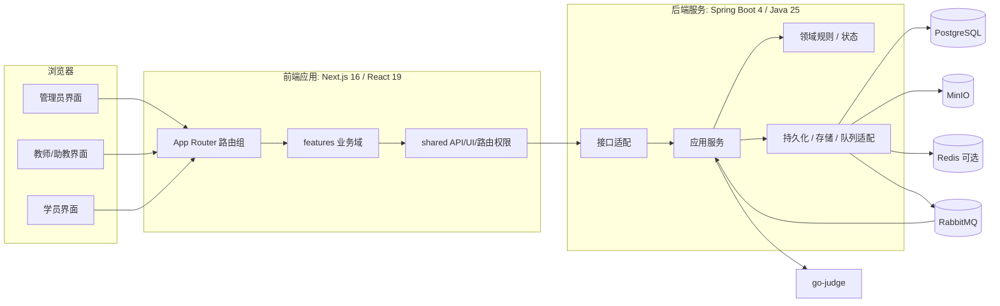

### 2.2 工程结构设计

| 逻辑目录 | 责任 | 关键结构 |
| --- | --- | --- |
| 前端路由层 | 页面、布局、路由分组 | 认证区、管理员区、教师区、学员区 |
| 前端业务域层 | 前端业务域封装 | 认证、平台治理、课程、作业、提交、评测、成绩、实验、通知 |
| 前端共享层 | 前端共享能力 | API client、OpenAPI 类型、路由权限、通用 UI、Hooks、配置 |
| 后端业务模块层 | 后端业务模块 | 身份认证、组织、平台配置、课程、作业、提交、评测、成绩、实验、通知、审计 |
| 后端共享层 | 后端共享能力 | 错误模型、分页、对象存储、限流、缓存、请求上下文 |
| 后端配置层 | 后端框架配置 | Security、JWT、MyBatis、MinIO、go-judge、RabbitMQ、异步执行 |
| 数据库迁移层 | 数据库迁移 | Flyway 版本化迁移脚本 |
| 过程文档层 | 项目过程文档 | 计划、需求、概要设计、详细设计、测试、部署、用户手册 |

后端模块内部分层如下：

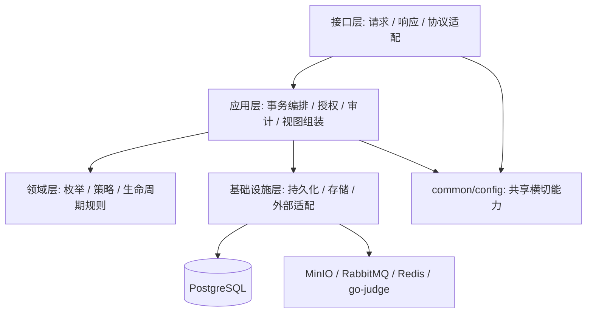

### 2.3 子系统划分

| 子系统编号 | 子系统 | 后端设计边界 | 前端设计边界 | 核心职责 |
| --- | --- | --- | --- | --- |
| S01 | 身份认证与授权 | 会话、JWT、当前用户和权限校验 | 登录页、当前用户装配、角色路由保护 | 登录、刷新、退出、当前用户、会话撤销、路由权限 |
| S02 | 平台治理与组织 | 平台配置、组织、用户、治理身份和审计 | 管理员治理页面 | 平台配置、组织树、用户、作用域身份、审计 |
| S03 | 课程与成员 | 课程主数据、教学班、成员和课程内容 | 管理员/教师/学员课程页面 | 学期、课程目录、开课、教学班、成员、公告、资源、讨论 |
| S04 | 作业与题库 | 作业生命周期、结构化试卷和题库 | 作业、试卷编辑和题库页面 | 作业生命周期、试卷结构、题库、编程题配置 |
| S05 | 提交与在线工作区 | 工作区、修订、附件和正式提交 | 学员作业、在线工作区和提交详情 | 工作区文件树、修订、附件、正式提交、提交详情 |
| S06 | 判题与样例运行 | 样例运行、正式评测、队列和报告 | 评测状态、报告展示和重排队入口 | 样例运行、正式评测、go-judge 适配、报告、重排队 |
| S07 | 批改与成绩 | 人工评分、成绩发布、成绩册和导出 | 批改、成绩册和学员成绩页 | 人工批改、成绩调整、导入导出、成绩发布、成绩册 |
| S08 | 实验与附件 | 实验定义、报告、附件、环境模板和会话 | 教师实验管理、学员实验和 Web 终端 | 报告型实验、终端实验、附件上传下载、评阅发布 |
| S09 | 通知与公告 | 站内通知、收件状态和课程公告触发 | 通知页、未读数和增量刷新 | 站内通知、未读数、SSE 流、公告触达 |
| S10 | 审计与运维观测 | 审计、健康检查、指标和请求追踪 | 审计日志页面和运维文档 | 请求追踪、关键操作审计、健康检查、指标 |

### 2.4 子系统活动图与顺序图

#### S01 身份认证与授权

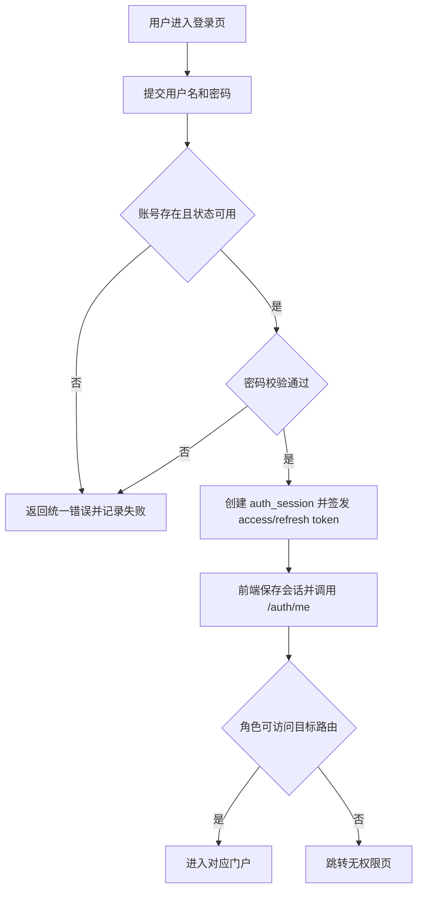

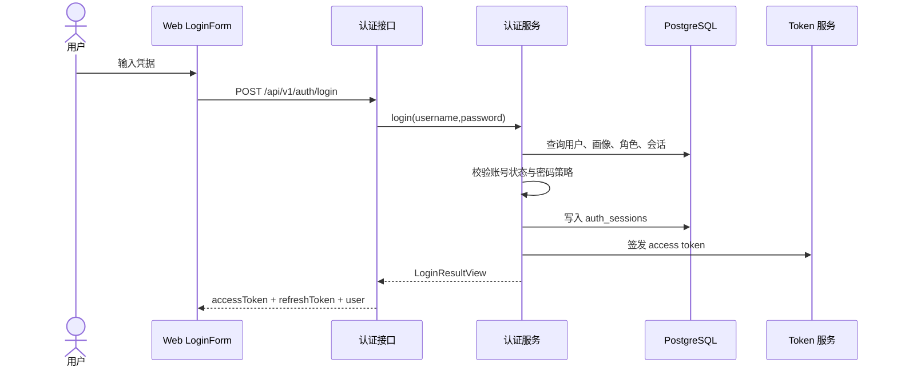

#### S02 平台治理与组织

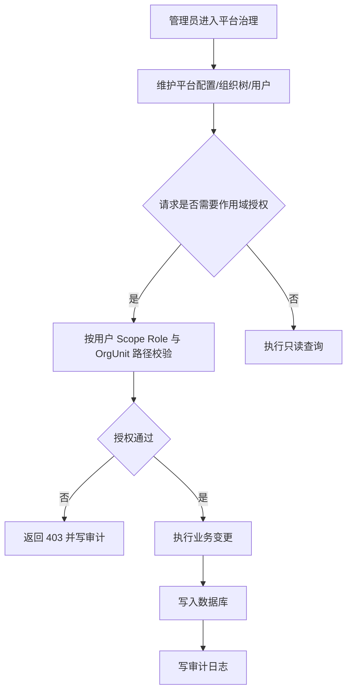

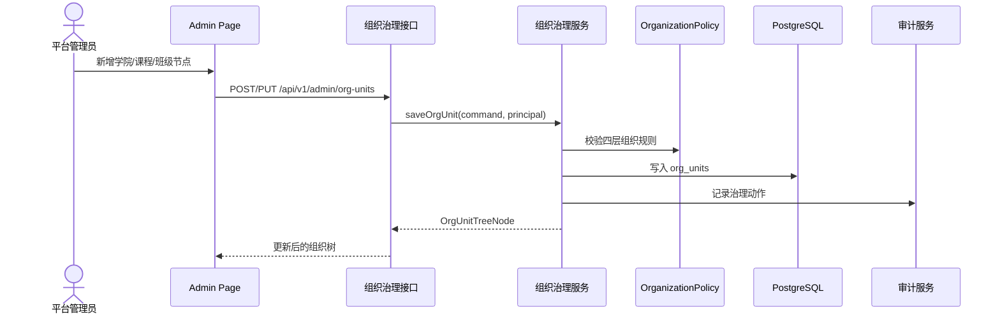

#### S03 课程与成员

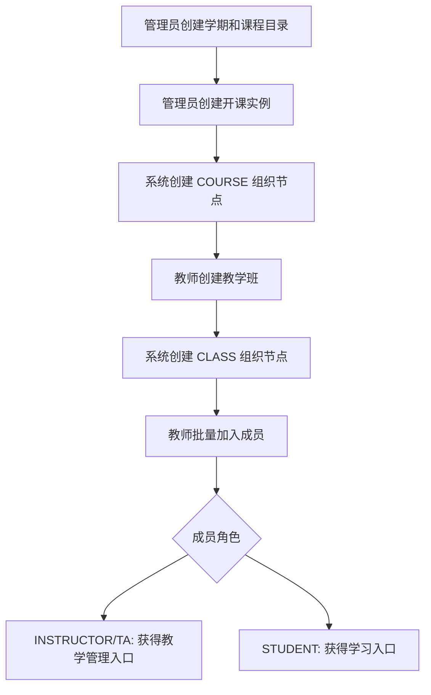

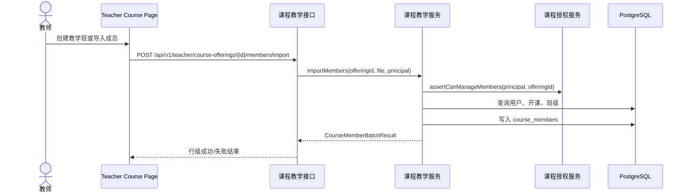

#### S04 作业与题库

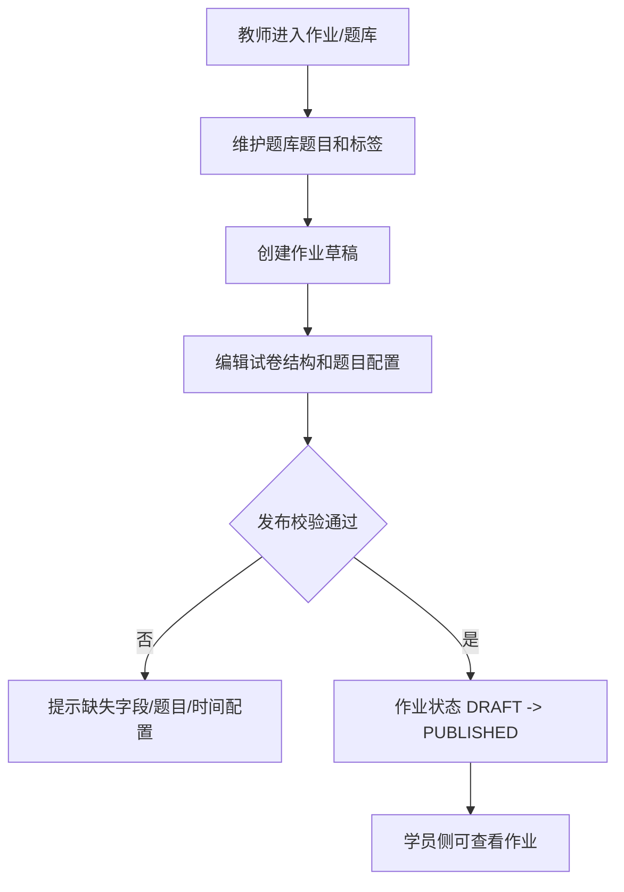

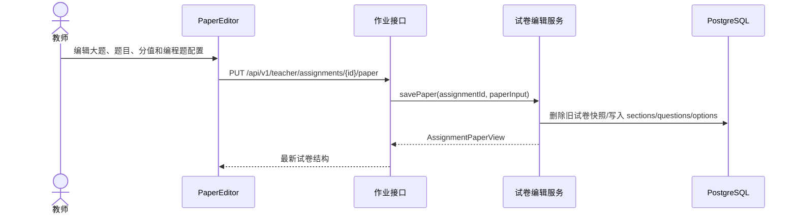

#### S05 提交与在线工作区

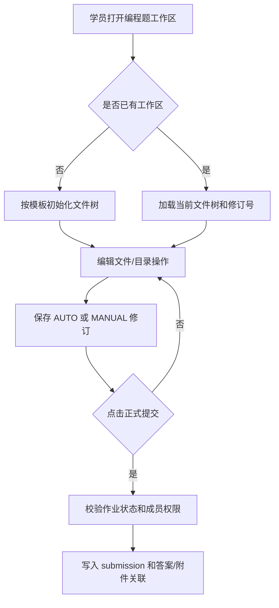

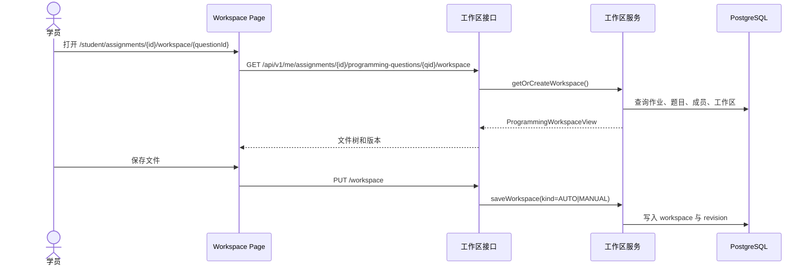

#### S06 判题与样例运行

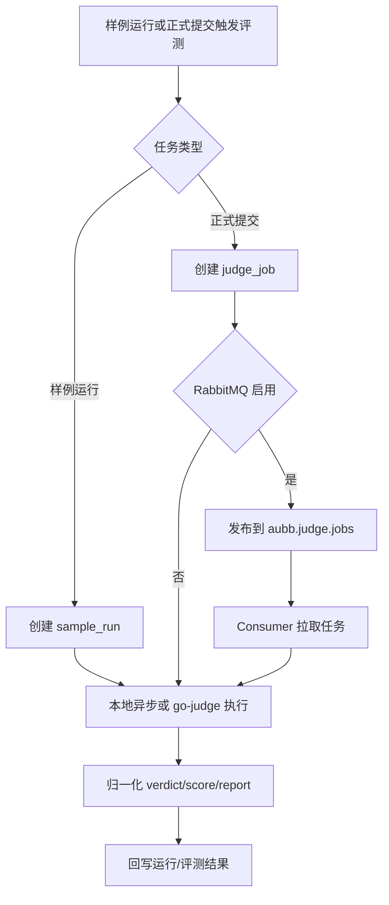

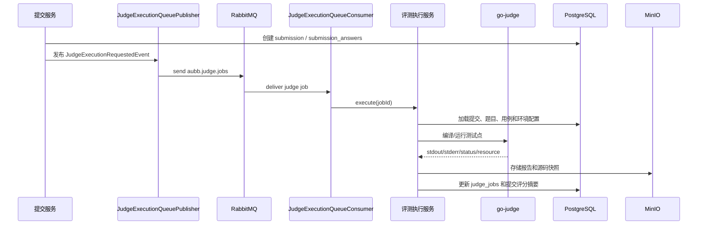

#### S07 批改与成绩

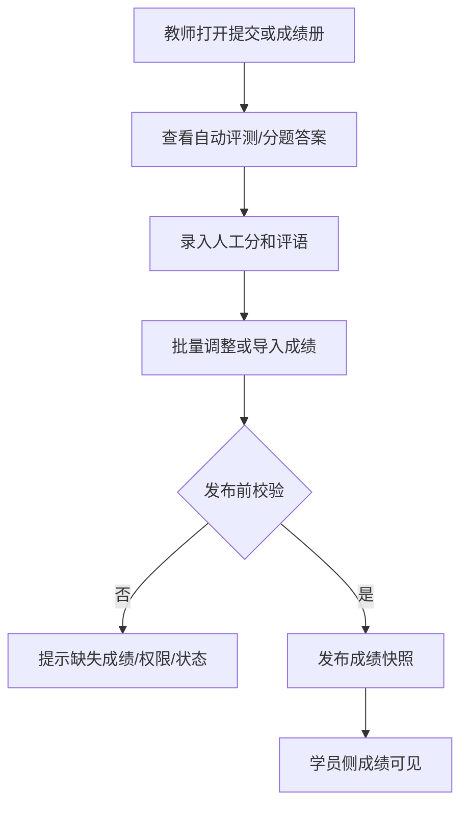

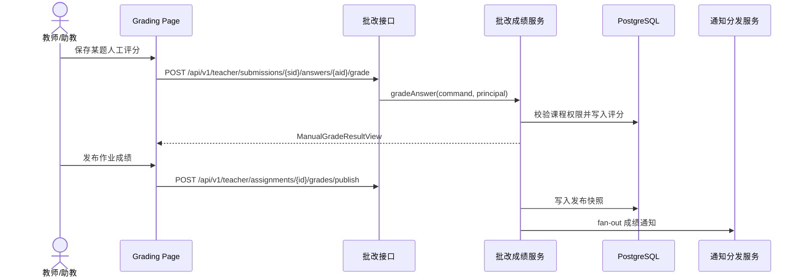

#### S08 实验与附件

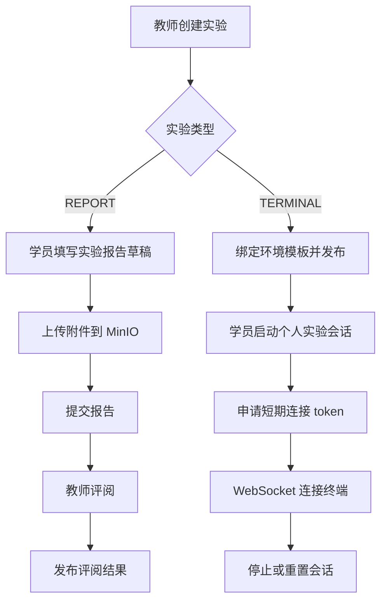

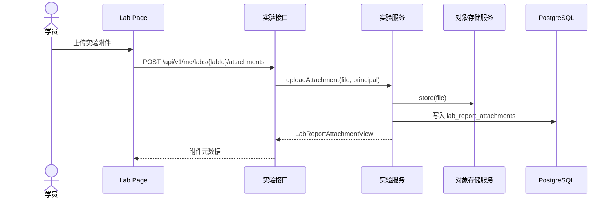

环境型实验会话独立于实验报告保存。报告正文、附件和评语仍走报告模型；终端连接只使用短期 token 建立 WebSocket 会话，不把长效登录凭证直接暴露给运行时。

#### S09 通知与公告

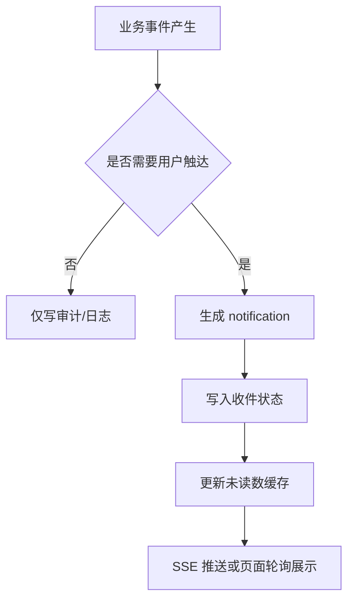

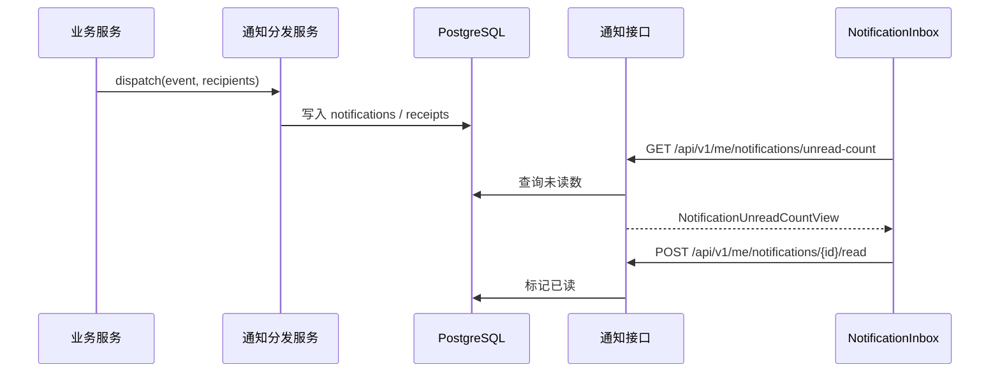

#### S10 审计与运维观测

```mermaid
flowchart TD
  A["请求进入后端"] --> B["RequestIdFilter 注入 requestId"]
  B --> C["接口层和应用层执行业务"]
  C --> D{"关键治理动作"}
  D -- 是 --> E["审计服务写入记录"]
  D -- 否 --> F["仅写结构化日志"]
  E --> G["管理员审计页查询"]
  F --> H["健康检查/Prometheus 指标"]
```

```mermaid
sequenceDiagram
  actor Admin as 管理员
  participant W as Audit Page
  participant C as 审计查询接口
  participant S as 审计服务
  participant DB as PostgreSQL

  Admin->>W: 输入筛选条件
  W->>C: GET /api/v1/admin/audit-logs
  C->>S: page(query)
  S->>DB: 分页查询 audit_logs
  S-->>C: PageResponse<AuditLogView>
  C-->>W: 审计列表
```

## 3 功能模块设计

### 3.1 模块清单

| 模块编号 | 模块名称 | 输入 | 处理 | 算法描述 | 输出 |
| --- | --- | --- | --- | --- | --- |
| M01 | 登录认证 | 用户名、密码、客户端上下文 | 校验账号状态、密码哈希、限流、创建会话 | 查询 `users` 与画像，失败递增计数，成功写 `auth_sessions` 并签发 JWT | `LoginResultView`、审计记录 |
| M02 | Token 刷新 | refresh token | 校验 token hash、会话状态、账号状态 | opaque token 只存 hash，刷新时轮换 access token | 新 access token |
| M03 | 当前用户装配 | JWT `sid`、用户 ID | 回查会话、用户、画像、组织身份和权限 | 以 `sid` 作为会话即时失效锚点 | `AuthenticatedUserView` |
| M04 | 平台配置 | 平台名称、Logo、主题、模块开关 | 单份配置更新、即时生效、审计 | 读取当前配置；更新时覆盖字段并记录操作者 | `PlatformConfigView` |
| M05 | 组织树 | OrgUnit 编码、名称、类型、父节点 | 校验四层组织结构、唯一编码、父子类型 | `SCHOOL -> COLLEGE -> COURSE -> CLASS` 固定层级校验 | `OrgUnitTreeNode` |
| M06 | 用户治理 | 用户基础资料、画像、组织成员、作用域身份 | 创建、导入、查询、状态变更、会话撤销 | 批量导入逐行校验，局部成功返回错误列表 | `UserView`、导入结果 |
| M07 | 权限解释 | 用户、权限码、资源 ID | 计算角色、权限、作用域、资源归属 | RBAC 权限集合与 ABAC 资源路径结合 | `AuthzExplainView` |
| M08 | 学期管理 | 学期编码、时间、状态 | 创建/更新/分页查询 | 编码大小写不敏感唯一，时间区间一致性校验 | `AcademicTermView` |
| M09 | 课程目录 | 课程编码、学院、学分、类型 | 创建/更新课程模板 | 课程目录归属学院并与开课实例解耦 | `CourseCatalogView` |
| M10 | 开课实例 | 课程目录、学期、主/协同学院、容量 | 创建开课并维护 COURSE 组织节点 | 跨学院映射写入 `course_offering_college_maps` | `CourseOfferingView` |
| M11 | 教学班 | 开课实例、班级编码、功能开关 | 创建班级、更新公告/资源/讨论/实验/作业开关 | 班级创建时同步 CLASS 组织节点 | `TeachingClassView` |
| M12 | 课程成员 | 用户、角色、班级、来源 | 批量添加、导入、状态变更、转班 | INSTRUCTOR/TA/STUDENT 角色按班级绑定规则校验 | `CourseMemberView`、批处理结果 |
| M13 | 课程公告 | 标题、内容、发布范围 | 教师创建/编辑/删除，学员查询 | 以开课和教学班成员作为可见性边界 | 公告列表/详情 |
| M14 | 课程资源 | 文件、标题、可见范围 | 上传 MinIO、写资源元数据、鉴权下载 | 数据库保存对象引用，下载时校验成员关系 | 资源列表、下载响应 |
| M15 | 课程讨论 | 主题、回复、锁定状态 | 创建主题、回复、教师锁定 | 讨论开关与课程成员身份共同控制访问 | 讨论列表/详情 |
| M16 | 题库题目 | 题型、内容、选项、标签、编程配置 | 创建/更新/归档、分类与标签查询 | 题型驱动配置 JSON 校验；归档不物理删除 | `QuestionBankQuestionView` |
| M17 | 作业基础信息 | 标题、开放/截止时间、状态、规则 | 创建/更新/发布/关闭 | 发布前校验时间、题目、评分与编程环境完整性 | `AssignmentView` |
| M18 | 试卷编辑 | 大题、题目、选项、分值 | 保存结构化试卷快照 | 先校验总分和题型配置，再替换当前试卷结构 | `AssignmentPaperView` |
| M19 | 编程工作区 | 作业 ID、题目 ID、文件树、保存类型 | 初始化、保存、文件操作、恢复修订、重置模板 | revision 追加记录，支持 `AUTO_SAVE`、`MANUAL_SAVE`、`FILE_OPERATION` | `ProgrammingWorkspaceView`、修订列表 |
| M20 | 附件上传 | 作业 ID、问题 ID、文件 | 限流、大小校验、对象存储、元数据落库 | 文件先存储后记录 artifact；失败时不关联提交 | `SubmissionArtifactView` |
| M21 | 正式提交 | 作业 ID、分题答案、附件引用、工作区内容 | 校验成员、状态、题型答案，写提交和答案 | `submissions` 追加，初始状态为 `SUBMITTED`；编程题触发评测事件 | `SubmissionView` |
| M22 | 提交查询 | 提交 ID、作业 ID、分页参数 | 学员/教师按作用域查询详情和列表 | 查询时按学员本人或教师课程范围过滤 | 提交列表/详情 |
| M23 | 样例运行 | 工作区、语言、输入模式、自定义 stdin | 创建 `ProgrammingSampleRun` 并执行 | 状态 `RUNNING -> SUCCEEDED/FAILED`，不参与成绩 | `ProgrammingSampleRunView` |
| M24 | 评测环境配置 | 语言、镜像/命令、资源限制 | 教师创建/更新/归档环境 Profile | 归档保留历史引用，新题只选活动环境 | `JudgeEnvironmentProfileView` |
| M25 | 评测队列发布 | Judge job ID、触发类型 | 发送 RabbitMQ 或本地异步执行 | 队列启用时发送 `aubb.judge.jobs`，配置 DLQ 和重试 | 队列消息/本地任务 |
| M26 | 评测执行 | Judge job、提交、测试点、环境 | 编译、运行、判定、存储报告、回写状态 | go-judge 状态映射为平台 `JudgeVerdict`，总分按测试点权重累计 | `JudgeJobView`、报告 |
| M27 | 评测报告下载 | Judge job ID、当前用户 | 校验所有权/教师权限、读取对象存储 | 报告和源码快照按 object key 取回 | 下载响应 |
| M28 | 人工评分 | 提交答案、分数、评语 | 保存人工分、更新提交分题评分状态 | 教师/助教作用域控制；分数范围与题目分值一致 | `ManualGradeResultView` |
| M29 | 成绩批量调整 | 作业 ID、学生成绩列表 | 批量校验、局部成功、返回行级结果 | 使用事务批量写入，失败行不影响有效行 | `BatchManualGradeResultView` |
| M30 | 成绩发布 | 作业 ID | 校验可发布状态，写入发布状态并通知 | 首次发布时间不因重新发布重置，重新发布记录操作者和通知语义 | `AssignmentGradePublicationView` |
| M31 | 成绩册 | 开课/班级/学生 ID、筛选条件 | 汇总作业列、学生行、统计与导出 | 分页查询学生行，按作业列组装分数单元格 | `GradebookPageView`、导出文件 |
| M32 | 实验管理 | 实验标题、内容、类型、环境模板、截止时间、附件 | 教师创建/发布/关闭，学员提交报告或启动终端会话 | 报告状态 `DRAFT -> SUBMITTED -> REVIEWED -> PUBLISHED`；终端会话独立流转 | `LabView`、`LabReportView`、`LabSessionView` |
| M33 | 通知中心 | 业务事件、收件人、通知类型 | 写通知、写收件状态、未读数查询、已读 | 站内通知同步入库，SSE/轮询用于前端更新 | `NotificationView`、未读数 |
| M34 | 审计日志 | 操作人、动作、目标、结果、元数据 | 关键操作统一记录、分页查询 | requestId 串联请求日志与审计记录 | `AuditLogView` |

### 3.2 关键算法与处理规则

#### 3.2.1 认证与路由权限算法

```text
1. 用户登录成功后，服务端签发 access token，并创建 auth_sessions。
2. 前端启动时调用 /api/v1/auth/me，得到当前用户、作用域身份和权限摘要。
3. route-access 根据 pathname 判断目标区域：admin / teacher / student。
4. role-guard 根据当前用户身份判断是否允许进入区域。
5. 后端所有受保护接口再次通过 Spring Security 与应用层作用域授权校验。
6. logout、revoke、账号停用或管理员强制失效后，后端按 sid 回查会话并拒绝旧 token。
```

```mermaid
flowchart TD
  A["JWT 验签通过"] --> B["提取 userId 和 sid"]
  B --> C["查询 auth_sessions"]
  C --> D{"会话有效且账号 ACTIVE"}
  D -- 否 --> E["401 / 清空前端会话"]
  D -- 是 --> F["装配 AuthenticatedUserPrincipal"]
  F --> G["接口层粗粒度权限"]
  G --> H["应用层数据作用域校验"]
```

#### 3.2.2 课程作用域授权算法

```text
1. 对平台治理入口，按用户 Scope Role 与 OrgUnit 祖先路径判断可管理范围。
2. 对课程教学入口，按 course_members 判断用户是否是开课或班级范围内的 INSTRUCTOR / TA。
3. 对学员入口，按 course_members 判断用户是否是目标教学班 ACTIVE 学员。
4. 对跨学院开课，主学院与协同学院关系来自 course_offering_college_maps。
5. 所有列表查询必须先收敛可见 offering/class 范围，再执行分页查询。
```

#### 3.2.3 提交受理算法

```mermaid
flowchart TD
  A["POST /api/v1/me/assignments/{id}/submissions"] --> B["校验登录态"]
  B --> C["加载作业、试卷、课程成员"]
  C --> D{"作业 PUBLISHED 且未关闭"}
  D -- 否 --> X["拒绝提交"]
  D -- 是 --> E{"当前用户是 ACTIVE 学员"}
  E -- 否 --> X
  E -- 是 --> F["校验每道题答案/附件/工作区引用"]
  F --> G["写入 submissions"]
  G --> H["写入 submission_answers 和 artifacts 关联"]
  H --> I{"存在可自动评测编程题"}
  I -- 是 --> J["创建 judge_jobs 并发布事件"]
  I -- 否 --> K["返回提交详情"]
  J --> K
```

#### 3.2.4 评测执行与结果归一化算法

```text
1. 评测执行服务根据 jobId 加载提交、答案、编程题配置、用例和执行环境。
2. 对编译型语言先向 go-judge 发起编译请求，编译失败直接归一化为 SYSTEM_ERROR 或 RUNTIME_ERROR 类结果。
3. 对每个测试点独立构造运行请求，注入 stdin、资源限制和待执行文件。
4. 将 go-judge 返回状态映射到 JudgeVerdict：
   Accepted -> ACCEPTED
   Time Limit Exceeded -> TIME_LIMIT_EXCEEDED
   Memory Limit Exceeded -> MEMORY_LIMIT_EXCEEDED
   Output Limit Exceeded -> OUTPUT_LIMIT_EXCEEDED
   Non Zero Exit Status / Signalled -> RUNTIME_ERROR
   Internal Error / File Error -> SYSTEM_ERROR
5. 按测试点权重累计得分，生成摘要、详细报告、源码快照和 artifact trace。
6. 回写 judge_jobs 状态：PENDING / RUNNING / SUCCEEDED / FAILED。
```

#### 3.2.5 成绩发布算法

```text
1. 教师选择作业并发起发布。
2. 系统校验教师/助教是否具有该开课或班级成绩发布权限。
3. 系统扫描提交答案、人工分、自动评测分和批量调整结果，生成最终分数。
4. 不满足发布前置条件的记录返回行级问题。
5. 满足条件后更新作业成绩发布状态，学生侧成绩册开始按发布规则可见。
6. 发布或重新发布事件进入通知中心，向相关学员生成站内通知。
```

### 3.3 状态机设计

#### 3.3.1 作业状态机

```mermaid
stateDiagram-v2
  [*] --> DRAFT
  DRAFT --> PUBLISHED: publish
  PUBLISHED --> CLOSED: close
  CLOSED --> [*]
```

#### 3.3.2 工作区修订状态

```mermaid
stateDiagram-v2
  [*] --> Loaded
  Loaded --> Dirty: edit file
  Dirty --> Saving: AUTO/MANUAL save
  Saving --> Loaded: success and append revision
  Saving --> Dirty: failure
  Loaded --> Restoring: restore revision
  Restoring --> Loaded: RESTORE revision
  Loaded --> Resetting: reset to template
  Resetting --> Loaded: TEMPLATE_RESET revision
```

#### 3.3.3 样例运行状态机

```mermaid
stateDiagram-v2
  [*] --> RUNNING
  RUNNING --> SUCCEEDED: go-judge success
  RUNNING --> FAILED: compile/runtime/system failure
  SUCCEEDED --> [*]
  FAILED --> [*]
```

#### 3.3.4 评测任务状态机

```mermaid
stateDiagram-v2
  [*] --> PENDING
  PENDING --> RUNNING: consumer starts
  RUNNING --> SUCCEEDED: all cases finalized
  RUNNING --> FAILED: execution or normalization failed
  FAILED --> PENDING: teacher requeue
  SUCCEEDED --> PENDING: teacher requeue
```

#### 3.3.5 实验报告状态机

```mermaid
stateDiagram-v2
  [*] --> DRAFT
  DRAFT --> SUBMITTED: submit
  SUBMITTED --> REVIEWED: teacher review
  REVIEWED --> PUBLISHED: publish review
  PUBLISHED --> [*]
```

### 3.4 数据结构与实体关系

```mermaid
erDiagram
  ORG_UNITS ||--o{ ORG_UNITS : parent
  ORG_UNITS ||--o{ USERS : primary_org
  USERS ||--|| ACADEMIC_PROFILES : has
  USERS ||--o{ USER_SCOPE_ROLES : owns
  USERS ||--o{ USER_ORG_MEMBERSHIPS : belongs
  ORG_UNITS ||--o{ USER_SCOPE_ROLES : scope
  COURSE_CATALOGS ||--o{ COURSE_OFFERINGS : creates
  ACADEMIC_TERMS ||--o{ COURSE_OFFERINGS : schedules
  COURSE_OFFERINGS ||--o{ TEACHING_CLASSES : contains
  COURSE_OFFERINGS ||--o{ COURSE_MEMBERS : has
  TEACHING_CLASSES ||--o{ COURSE_MEMBERS : binds
  COURSE_OFFERINGS ||--o{ ASSIGNMENTS : owns
  ASSIGNMENTS ||--o{ ASSIGNMENT_SECTIONS : contains
  ASSIGNMENT_SECTIONS ||--o{ ASSIGNMENT_QUESTIONS : contains
  QUESTION_BANK_QUESTIONS ||--o{ ASSIGNMENT_QUESTIONS : snapshots
  ASSIGNMENTS ||--o{ SUBMISSIONS : accepts
  SUBMISSIONS ||--o{ SUBMISSION_ANSWERS : contains
  SUBMISSION_ANSWERS ||--o{ JUDGE_JOBS : triggers
  SUBMISSIONS ||--o{ JUDGE_JOBS : triggers
  COURSE_OFFERINGS ||--o{ LABS : owns
  LABS ||--o{ LAB_REPORTS : accepts
  USERS ||--o{ NOTIFICATIONS : receives
  USERS ||--o{ AUDIT_LOGS : acts
```

核心数据存储原则：

| 原则 | 设计 |
| --- | --- |
| 事实来源 | PostgreSQL 保存平台、课程、作业、提交、评测、成绩、实验、通知和审计主数据 |
| 结构演进 | 所有表结构通过 Flyway 迁移管理 |
| 文件内容 | 课程资源、附件、评测报告、源码快照进入 MinIO，对业务表保存 object key 和元数据 |
| 状态字段 | 关键对象使用显式枚举，不用隐式布尔组合表达生命周期 |
| 权限边界 | 平台治理身份、组织成员关系、课程成员关系分开建模 |

## 4 界面设计

### 4.1 外部界面设计

#### 4.1.1 用户页面入口

| 区域 | 路由 | 页面 | 主要功能 |
| --- | --- | --- | --- |
| 认证 | `/login` | 登录页 | 登录、错误提示、登录后按角色跳转 |
| 通用 | `/me/notifications` | 通知中心 | 通知列表、未读数、标记已读 |
| 管理员 | `/admin` | 管理首页 | 平台治理入口 |
| 管理员 | `/admin/platform-config` | 平台配置 | 平台名称、主题、登录提示、模块配置 |
| 管理员 | `/admin/org-units` | 组织管理 | 学校/学院/课程/班级组织树 |
| 管理员 | `/admin/users` | 用户管理 | 用户创建、导入、详情、状态、身份 |
| 管理员 | `/admin/auth-explain` | 权限解释 | 权限码、资源、用户作用域解释 |
| 管理员 | `/admin/academic-terms` | 学期管理 | 学期创建、编辑、查询 |
| 管理员 | `/admin/course-catalogs` | 课程目录 | 课程模板维护 |
| 管理员 | `/admin/course-offerings` | 开课管理 | 开课实例、跨学院管理 |
| 管理员 | `/admin/audit-logs` | 审计日志 | 审计查询与筛选 |
| 教师 | `/teacher` | 教师首页 | 教学概览入口 |
| 教师 | `/teacher/courses` | 我的课程 | 开课、班级、成员、公告、资源、讨论 |
| 教师 | `/teacher/assignments` | 作业管理 | 作业列表、发布、关闭 |
| 教师 | `/teacher/assignments/create` | 创建作业 | 作业基础信息和试卷编辑 |
| 教师 | `/teacher/assignments/[assignmentId]/edit` | 编辑作业 | 草稿、试卷、发布 |
| 教师 | `/teacher/question-bank` | 题库 | 题目、标签、分类 |
| 教师 | `/teacher/submissions` | 提交管理 | 提交列表、详情、下载、评测 |
| 教师 | `/teacher/grading/gradebook` | 成绩册 | 人工评分、导入导出、发布 |
| 教师 | `/teacher/labs` | 实验管理 | 实验、报告、评阅 |
| 学员 | `/student` | 学员首页 | 学习入口 |
| 学员 | `/student/courses` | 我的课程 | 课程公告、资源、讨论 |
| 学员 | `/student/assignments` | 我的作业 | 作业列表、详情、提交 |
| 学员 | `/student/assignments/[assignmentId]/workspace/[questionId]` | 在线工作区 | 文件树、编辑、保存、样例运行、提交 |
| 学员 | `/student/submissions/[submissionId]` | 提交详情 | 分题答案、评测报告、附件下载 |
| 学员 | `/student/grades` | 我的成绩 | 成绩册、导出 |
| 学员 | `/student/labs` | 我的实验 | 实验报告和附件 |
| 通用 | `/unauthorized` | 无权限页 | 权限失败提示 |

#### 4.1.2 外部 API 分组

| API 分组 | 接口边界 | 主要接口 |
| --- | --- | --- |
| 认证 | 统一认证入口 | `/api/v1/auth/login`、`/refresh`、`/logout`、`/revoke`、`/me` |
| 平台配置 | 管理员平台配置入口 | `/api/v1/admin/platform-config/current` |
| 组织 | 管理员组织治理入口 | `/api/v1/admin/org-units` |
| 用户 | 管理员用户治理入口 | `/api/v1/admin/users`、`/import`、`/{id}/status`、`/{id}/sessions/revoke` |
| 权限解释 | 管理员权限解释入口 | `/api/v1/admin/auth/groups`、`/explain` |
| 课程治理 | 管理员学期、课程目录和开课入口 | 学期、课程目录、开课 CRUD |
| 教学管理 | 教师课程运营入口 | 班级、成员、成员导入、转班、功能开关 |
| 课程内容 | 课程公告、资源和讨论入口 | 公告、资源、讨论 |
| 作业题库 | 教师作业、试卷和题库入口 | 作业、试卷、题库、学员作业查询 |
| 工作区提交 | 学员提交与教师提交查询入口 | 工作区、附件、提交、提交详情 |
| 判题 | 样例运行、评测报告和环境配置入口 | 样例运行、评测报告、重排队、环境配置 |
| 批改成绩 | 教师批改、成绩册和学员成绩入口 | 人工评分、成绩发布、成绩册、导出 |
| 实验 | 教师和学员实验入口 | 实验、报告、附件、评阅、环境模板、会话、连接 token |
| 通知 | 个人通知入口 | 通知分页、未读数、SSE、已读 |
| 审计 | 管理员审计查询入口 | 审计日志分页查询 |

#### 4.1.3 外部依赖接口

| 外部系统 | 使用方式 | 失败策略 |
| --- | --- | --- |
| PostgreSQL | Hikari 连接池、MyBatis-Plus、Flyway | 数据库不可用时健康检查失败，业务接口返回系统错误 |
| MinIO | 通过对象存储服务统一适配 | 上传失败回滚业务关联，下载失败返回可重试错误 |
| RabbitMQ | `JudgeExecutionQueuePublisher/Consumer`，队列 `aubb.judge.jobs`，DLQ `aubb.judge.jobs.dlq` | 队列关闭时可回退本地异步执行；消费失败按配置重试后进入 DLQ |
| Redis | 可选缓存、限流、健康增强 | Redis 不可用时按降级策略回退内存/无缓存能力 |
| go-judge | REST 客户端调用 `/run` 与 `/version` | 执行失败归一化为评测失败，保留原始报告用于排查 |
| 实验运行时 | Fake Runtime 或 Kubernetes Runtime | Fake 用于本地演示；Kubernetes 用于真实隔离终端实验，启动失败返回会话错误 |

### 4.2 内部界面设计

#### 4.2.1 前端内部调用关系

```mermaid
flowchart TD
  Page["角色路由页面"] --> Hook["业务 Hooks"]
  Page --> Component["业务组件"]
  Hook --> Api["业务 API 封装"]
  Component --> Model["业务模型"]
  Api --> Client["shared/api/client"]
  Client --> Generated["shared/api/generated/openapi"]
  Page --> Layout["shared/ui/layout"]
  Layout --> RouteAccess["shared/routing/route-access"]
```

前端内部接口规则：

| 接口 | 规则 |
| --- | --- |
| `apiClient` | 所有 HTTP 请求统一经过 Axios client，负责 baseUrl、token、错误拦截 |
| `queryKeys` | TanStack Query key 按业务域组织，列表包含分页参数，详情包含实体 ID |
| `useApiMutation` | 写操作统一处理进行中、错误、成功回调与缓存失效 |
| `route-access` | 根据 pathname 和当前用户身份判断角色区可访问性 |
| `nav-config` | 管理员、教师、学员侧导航统一配置，避免页面内硬编码 |
| `notification-stream` | SSE 可用时订阅通知，否则降级到查询接口 |

#### 4.2.2 后端内部调用关系

```mermaid
flowchart TD
  Controller["接口适配"]
  Request["请求模型"]
  AppService["应用服务"]
  Policy["领域策略 / 授权服务"]
  Mapper["持久化访问"]
  Entity["数据实体"]
  View["响应视图"]
  Audit["审计服务"]
  Queue["队列发布"]
  Storage["对象存储服务"]

  Controller --> Request
  Controller --> AppService
  AppService --> Policy
  AppService --> Mapper
  Mapper --> Entity
  AppService --> View
  AppService --> Audit
  AppService --> Queue
  AppService --> Storage
```

后端内部接口规则：

| 调用边界 | 设计约束 |
| --- | --- |
| 接口层 -> 应用层 | 接口层只做协议适配、参数校验和认证主体传递 |
| 应用层 -> 领域层 | 状态流转、密码策略、组织规则、课程授权等通过领域策略或授权服务封装 |
| 应用层 -> 持久化访问 | 持久化访问只负责数据读写；复杂业务判断不得下沉到 SQL 拼接 |
| 应用层 -> 审计服务 | 关键治理、提交、重评、成绩发布等动作写审计 |
| 应用层 -> 队列 | 评测任务通过事件和队列发布解耦，避免接口层直接操作队列 |
| 应用层 -> 对象存储 | 文件和报告统一走对象存储服务，业务模块不得直接操作本地磁盘 |

### 4.3 用户界面设计

#### 4.3.1 总体风格

系统界面定位为教学管理和实训平台，采用低干扰、信息密度适中的后台应用风格：

| 设计项 | 规则 |
| --- | --- |
| 页面布局 | 顶部栏 + 侧边导航 + 内容区，按角色呈现不同导航 |
| 控件体系 | shadcn/ui 表单、按钮、表格、Dialog、Select、Badge、Switch |
| 数据列表 | 统一分页、筛选、空态、加载态、错误态 |
| 危险操作 | 发布、重新发布、关闭、删除、重评、导出等显示确认对话框 |
| 权限失败 | 前端展示无权限页，后端返回稳定 `403` 错误模型 |
| 文件操作 | 上传显示大小、类型、进度和失败原因；下载按钮统一复用组件 |

#### 4.3.2 管理员界面

管理员界面面向平台治理，突出可筛选、可追踪、可批量处理：

| 页面 | 核心区域 | 交互 |
| --- | --- | --- |
| 平台配置 | 基础信息、主题、登录提示、模块开关 | 表单保存后即时刷新配置 |
| 组织管理 | 左侧组织树、右侧节点详情和操作区 | 新增/编辑节点时校验父子层级 |
| 用户管理 | 筛选栏、用户表格、详情抽屉、导入结果 | 批量导入返回逐行错误 |
| 权限解释 | 用户选择、权限码、资源 ID、解释结果 | 展示命中角色、作用域和拒绝原因 |
| 审计日志 | 时间、动作、操作者、结果筛选 | 支持 requestId 定位 |

#### 4.3.3 教师/助教界面

教师界面围绕课程运营、作业评测和成绩闭环：

| 页面 | 核心区域 | 交互 |
| --- | --- | --- |
| 我的课程 | 开课卡片/表格、班级、成员入口 | 教师可管理开课，助教按授权范围查看 |
| 作业管理 | 作业状态、开放/截止时间、发布操作 | 草稿和发布状态清晰区分 |
| 试卷编辑 | 大题列表、题目配置、编程环境、分值 | 保存草稿与发布动作分离 |
| 提交详情 | 学员答案、附件、评测报告、人工评分 | 支持重评、下载报告、保存评语 |
| 成绩册 | 学生行、作业列、统计、导入导出 | 发布前显示校验问题 |
| 实验管理 | 实验列表、报告列表、附件、评阅 | 报告评阅和发布分离 |

#### 4.3.4 学员界面

学员界面围绕任务完成与反馈查看：

| 页面 | 核心区域 | 交互 |
| --- | --- | --- |
| 我的课程 | 当前课程、公告、资源、讨论入口 | 只显示有成员关系的课程 |
| 我的作业 | 作业状态、截止时间、提交入口 | 关闭或无权限时禁止提交 |
| 在线工作区 | 文件树、编辑器、运行输入、运行结果、提交按钮 | 自动保存、手动保存、文件操作、修订恢复、模板重置 |
| 提交详情 | 分题答案、附件、评测结果、报告下载 | 评测中/成功/失败状态明确 |
| 我的成绩 | 已发布成绩、导出入口、反馈 | 未发布成绩不展示 |
| 我的实验 | 实验说明、报告草稿、附件、评阅结果 | 草稿、提交、已评阅状态区分 |

#### 4.3.5 在线工作区布局图

```mermaid
flowchart LR
  subgraph IDE["在线工作区页面"]
    Tree["左侧 文件树/操作"]
    Editor["中部 Monaco 编辑器"]
    Console["底部 运行输入/输出"]
    Task["右侧 题目说明/提交规则"]
  end
  Tree --> Editor
  Editor --> Console
  Task --> Console
  Console --> Submit["正式提交"]
```

## 5 异常处理设计

### 5.1 出错信息管理

后端通过统一异常处理器输出稳定错误模型，前端通过统一 API client 和错误映射展示用户可理解的信息。

| 错误类型 | 后端处理 | 前端处理 |
| --- | --- | --- |
| `400` 请求参数错误 | Bean Validation 或业务校验返回字段级/业务错误 | 表单字段错误或页面 Toast |
| `401` 未认证/会话失效 | JWT 验签失败、`sid` 无效、refresh 失败 | 尝试一次 refresh，失败后清空会话并跳转登录 |
| `403` 无权限 | Spring Security 或应用层作用域拒绝 | 跳转无权限页或展示按钮禁用原因 |
| `404` 资源不存在 | Application Service 未找到资源 | 详情页展示不存在或已删除 |
| `409` 状态冲突 | 作业已关闭、成绩已发布、重复编码等 | 展示当前状态与下一步建议 |
| `413` 文件过大 | 上传大小限制或业务大小限制 | 文件控件提示大小上限 |
| `429` 限流 | 登录、样例运行、提交、上传等策略触发 | 倒计时或稍后重试提示 |
| `500` 系统错误 | 记录 requestId、异常栈和上下文 | 展示 requestId，避免暴露内部堆栈 |

错误信息链路：

```mermaid
flowchart TD
  A["业务异常/系统异常"] --> B["GlobalExceptionHandler"]
  B --> C["ApiErrorResponse"]
  C --> D["附带 requestId 和错误码"]
  D --> E["apiClient 拦截"]
  E --> F["页面错误态/Toast/表单错误"]
```

### 5.2 故障预防与补救

| 场景 | 预防 | 补救 |
| --- | --- | --- |
| 登录爆破 | Redis/内存限流、失败次数、账号锁定 | 管理员解锁账号，审计失败记录 |
| access token 泄露 | 短 TTL、`sid` 会话回查、退出/撤销即时失效 | 撤销用户会话或停用账号 |
| 组织层级错误 | `OrganizationPolicy` 固定层级校验 | 拒绝写入并提示父子类型不匹配 |
| 批量导入脏数据 | 行级校验、局部成功结果 | 返回错误行，允许修正后重复导入 |
| 工作区保存失败 | revision 追加、保存类型标识 | 保留最近成功修订，允许重试/恢复 |
| 提交重复点击 | 前端禁用进行中按钮，后端校验作业/成员/状态 | 返回当前提交详情或冲突提示 |
| 对象存储失败 | 上传与业务关联分步处理 | 失败不写关联，允许重新上传 |
| RabbitMQ 不可用 | readiness 暴露队列健康，支持本地异步执行配置 | 队列恢复后重新发布或教师重评 |
| 评测执行失败 | go-judge 健康检查、资源限制、DLQ 重试 | 归一化失败结果，教师可重排队 |
| 报告存储失败 | 对象存储异常捕获、artifact trace | 保留数据库结果，标注报告不可下载原因 |
| 成绩发布错误 | 发布前扫描缺失项和权限 | 阻止发布，返回行级问题 |
| 通知发送失败 | 站内通知先写库，SSE 作为增强 | 页面查询仍可看到通知 |

### 5.3 系统维护设计

| 维护项 | 设计 |
| --- | --- |
| 数据库迁移 | Flyway 脚本版本化，随应用启动或部署流程执行 |
| 健康检查 | Actuator 暴露 `health/info/prometheus`，readiness 包含 DB、Redis、MinIO、go-judge、judgeQueue |
| 日志追踪 | `RequestIdFilter` 注入 requestId，审计日志与异常响应带同一标识 |
| 队列治理 | RabbitMQ 设置重试、prefetch、concurrency 与 DLQ |
| 对象存储治理 | 对业务表保存 object key、大小、类型和可下载状态 |
| 缓存治理 | Redis 缓存设置短 TTL，失效后回源数据库 |
| 权限维护 | 管理员可查询权限解释，定位权限码、角色和作用域问题 |
| 文档维护 | 过程文档随需求、设计、接口和测试计划变更同步维护 |

## 6 性能优化和安全设计

### 6.1 性能优化设计

| 层次 | 优化点 | 设计策略 |
| --- | --- | --- |
| 前端路由 | 页面分区与角色导航 | App Router 按角色路由组拆分，减少页面内权限分支 |
| 前端数据 | TanStack Query 缓存 | 列表 key 包含分页参数，写操作后失效相关 query |
| 前端表格 | 分页和筛选 | 大列表均通过后端分页，不做无界加载 |
| API | Hikari 连接池 | 配置最大连接数、超时、Tomcat 线程和队列 |
| 数据库 | 索引与分页 | Flyway 已包含提交、成员、权限等性能索引迁移 |
| 缓存 | Redis 可选增强 | 会话、评测报告、未读数、我的课程、题库字典、组织作用域设置短 TTL |
| 评测 | 异步队列 | RabbitMQ 解耦提交受理和评测执行，避免长请求阻塞 |
| 评测并发 | 消费者配置 | `concurrency`、`prefetch`、本地执行线程池控制资源 |
| 文件 | 对象存储 | 大文件与评测报告不直接存数据库 |
| 通知 | 异步 fan-out | 通知分发使用独立执行器，避免阻塞主事务 |

### 6.2 安全设计

| 安全项 | 设计 |
| --- | --- |
| 认证 | JWT Bearer access token + opaque refresh token；refresh token 只保存 hash |
| 会话撤销 | access token 除验签外回查 `auth_sessions.sid`，支持即时失效 |
| 授权 | Spring Security 粗拦截 + Application Service 数据作用域校验 |
| 角色隔离 | 平台治理身份与课程成员角色分离建模 |
| 路由保护 | 前端 `role-guard` 控制角色区入口，后端仍作为最终权限来源 |
| 输入校验 | Request DTO 使用 Bean Validation；业务服务二次校验状态和作用域 |
| 文件安全 | 上传限制大小和类型，下载前校验所有权或课程权限 |
| 沙箱隔离 | 浏览器不直接访问 go-judge；执行资源受 CPU、内存、时间、输出大小限制 |
| 限流 | 登录、刷新、样例运行、提交、附件上传、实验附件上传配置限流策略 |
| 审计 | 登录、用户治理、权限变更、提交、重评、成绩发布等关键动作写审计 |
| 敏感信息 | 配置通过环境变量注入，不提交 JWT secret、对象存储密钥等真实凭据 |

### 6.3 部署与运行安全图

```mermaid
flowchart TD
  Browser["浏览器"] --> Nginx["Nginx / 前端服务"]
  Nginx --> API["Spring Boot API"]
  API --> DB[(PostgreSQL)]
  API --> Redis[(Redis)]
  API --> MinIO[(MinIO)]
  API --> MQ[(RabbitMQ)]
  MQ --> API
  API --> GJ["go-judge 内网地址"]
  subgraph Private["内网受控区域"]
    DB
    Redis
    MinIO
    MQ
    GJ
  end
```

安全边界要求：

| 边界 | 要求 |
| --- | --- |
| 浏览器到 API | 使用 HTTPS 部署，Authorization header 传递 access token |
| API 到数据库 | 使用最小权限数据库账号，禁止业务拼接 SQL |
| API 到对象存储 | bucket 权限不对公网开放，下载由后端鉴权后转发 |
| API 到 RabbitMQ | 队列账号按 vhost/queue 限权 |
| API 到 go-judge | 仅内网可访问，禁止浏览器直连 |

## 7 项目测试计划

| 序号 | 测试类型 | 对应部分 | 测试内容 | 计划测试时间 |
| --- | --- | --- | --- | --- |
| 1 | 单元测试 | 领域规则 | 密码策略、组织层级、权限码、治理角色、实验报告生命周期、通知收件生命周期 | 每次领域规则变更后 |
| 2 | 单元测试 | 前端工具与模型 | API mapper、query key、下载、错误映射、结构化答案表单 | 每次前端共享逻辑变更后 |
| 3 | 集成测试 | 认证与会话 | 登录、刷新、退出、会话撤销、账号停用即时失效 | 认证相关接口变更后 |
| 4 | 集成测试 | 平台治理 | 平台配置、组织树、用户导入、身份分配、权限解释 | 管理端功能变更后 |
| 5 | 集成测试 | 课程与成员 | 学期、课程目录、开课、跨学院、教学班、成员导入、转班、功能开关 | 课程域变更后 |
| 6 | 集成测试 | 作业与题库 | 题库、试卷编辑、作业发布/关闭、编程题配置 | 作业域变更后 |
| 7 | 集成测试 | 提交与工作区 | 工作区初始化、保存、文件操作、修订恢复、附件上传、正式提交 | 提交域变更后 |
| 8 | 集成测试 | 判题与报告 | 样例运行、评测入队、go-judge 执行、报告存储、重排队、DLQ 处理 | 判题域变更后 |
| 9 | 集成测试 | 批改与成绩 | 人工评分、批量调整、导入导出、成绩发布、学生侧可见性 | 成绩域变更后 |
| 10 | 集成测试 | 实验与通知 | 实验发布、报告提交、附件下载、通知未读数、SSE/轮询 | 实验或通知域变更后 |
| 11 | 安全测试 | 权限边界 | 管理员/教师/助教/学员跨角色访问、跨组织/跨课程数据访问、401/403 | 权限模型变更后 |
| 12 | 端到端测试 | 主链路 | 登录 -> 建课 -> 建班 -> 加成员 -> 发作业 -> 学员提交 -> 评测 -> 批改 -> 发布成绩 | 迭代验收前 |
| 13 | 端到端测试 | 按钮级交互 | 管理员、教师、学员主要页面按钮、表单、确认框、下载入口 | UI 交付验收前 |
| 14 | 性能测试 | 列表与提交 | 大量用户/成员/提交分页、评测队列堆积、成绩册导出 | 上线前或容量变更前 |
| 15 | 文档审查 | 过程文档 | 检查需求、概要设计、详细设计、API、测试计划之间的一致性 | 每次文档变更后 |

### 7.1 建议验证活动

| 范围 | 验证活动 |
| --- | --- |
| 后端格式 | 统一格式化与静态检查 |
| 后端测试 | 单元测试、集成测试、权限矩阵测试 |
| 后端完整验证 | 数据库迁移、接口契约、评测队列和对象存储适配验证 |
| 前端质量 | Lint、类型检查、组件单元测试 |
| 前端 E2E | 真实浏览器覆盖管理员、教师、学员主链路 |
| 前端构建 | 生产构建与静态资源检查 |
| 文档检查 | 过程文档结构、链接、图示和术语一致性检查 |
| 交付检查 | 需求、设计、实现、测试、部署材料的追踪关系检查 |

### 7.2 测试覆盖矩阵

```mermaid
flowchart TD
  Unit["单元测试"] --> Domain["领域策略/状态机"]
  Unit --> FrontShared["前端共享工具"]
  Integration["集成测试"] --> API["接口层 + 应用层 + 数据库"]
  Integration --> Queue["RabbitMQ / go-judge / MinIO"]
  E2E["端到端测试"] --> Browser["真实浏览器角色流程"]
  Security["安全测试"] --> Authz["401/403/作用域隔离"]
  Build["构建验证"] --> Docs["文档检查"]
  Build --> WebBuild["前端构建"]
```

### 7.3 验收准则

| 准则 | 说明 |
| --- | --- |
| 需求追踪 | 过程文档、模块地图、API、测试用例能追溯到 SRS 主要需求 |
| 功能闭环 | 管理员、教师、学员三类角色能完成核心教学主链路 |
| 权限闭环 | 未登录、无权限、跨作用域访问均被前后端共同拦截 |
| 数据闭环 | 作业、提交、评测、批改、成绩、通知、审计均有持久化记录 |
| 异常闭环 | 外部依赖失败时有明确错误、日志、审计或恢复路径 |
| 文档闭环 | 本文档与需求、概要设计、API 设计、测试计划和部署方案保持一致 |
