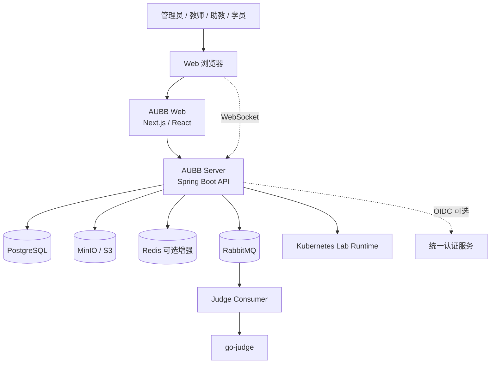
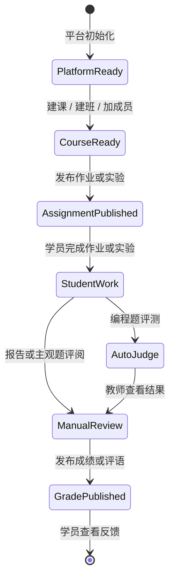
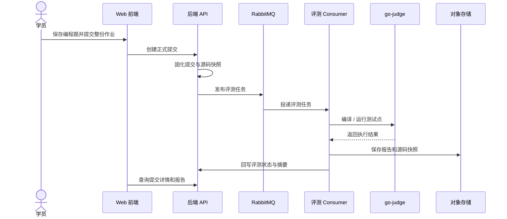
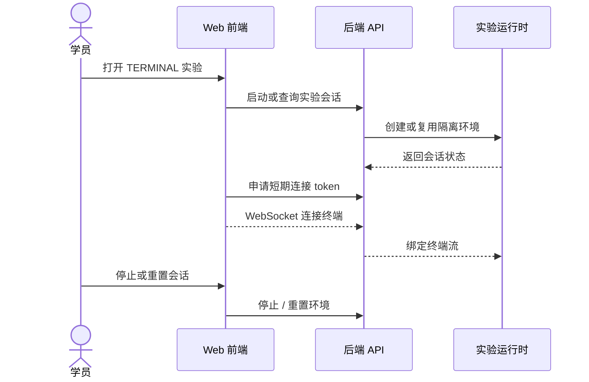
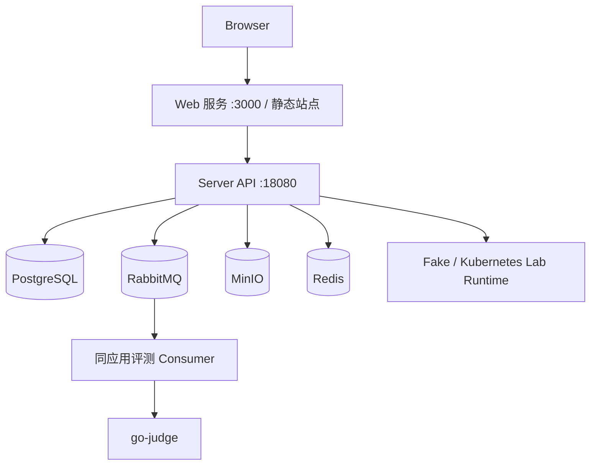

# 软件概要设计说明书

## 1. 文档信息

- 文档名称：AUBB（Academic Unified Builder Bench）软件概要设计说明书
- 版本：v1.4
- 状态：设计基线
- 更新日期：2026-06-12
- 编写依据：SRS、软件开发计划书、课程大作业要求、稳定 API 清单
- 参考标准：ISO/IEC/IEEE 42010、IEEE 1016-2009

## 2. 设计目标与约束

### 2.1 设计目标

1. 支撑“平台初始化 -> 建课建班 -> 发布作业或实验 -> 学员在线完成 -> 自动评测或教师评阅 -> 成绩发布 -> 学员查看反馈”的教学闭环。
2. 在课程项目复杂度可控的前提下，明确 Web 前端、后端业务服务、评测执行、对象存储、消息队列和实验运行时之间的职责边界。
3. 以稳定 API、角色权限、数据留痕和可复验部署为核心，保证演示、答辩和后续维护的一致性。

### 2.2 关键约束

- 系统主入口为现代 Web 浏览器，不建设原生客户端。
- 编程作业必须支持浏览器内在线 IDE 编辑、保存、试运行和整份作业提交。
- 在线 IDE 不提供通用终端；环境型实验通过独立 Web 终端能力承载。
- 代码试运行、正式评测和终端实验运行时必须与业务主服务隔离。
- 首版采用模块化单体后端，评测任务通过消息队列解耦；不引入分布式事务。
- `go-judge` 与 Kubernetes 实验运行时以 Linux 环境为主要部署前提。

## 3. 系统上下文

### 3.1 外部实体

| 外部实体 | 作用 | 与本系统交互内容 |
| --- | --- | --- |
| 浏览器 | 用户操作入口 | 页面访问、表单提交、在线 IDE、Web 终端、通知查看 |
| go-judge | 编程题试运行与正式评测 | 源码快照、运行参数、资源限制、执行结果 |
| Kubernetes 实验运行时 | 环境型实验会话 | 实验 Pod、WebSocket 终端、会话停止与重置 |
| S3 兼容对象存储 | 文件与报告保存 | 课程资源、提交附件、评测报告、实验附件 |
| 统一认证服务 | 可选身份源 | 用户身份信息、单点登录状态 |

### 3.2 系统上下文图

## 4. 总体技术选型

| 层次 | 技术 / 产品 | 选型说明 |
| --- | --- | --- |
| Web 前端 | Next.js 16、React 19、TypeScript、Tailwind CSS 4 | 支撑角色化后台、复杂表单和页面级路由组织 |
| 在线 IDE | Monaco Editor、标准输入输出面板 | 满足编程题编辑、保存、试运行和结果查看，不承载通用终端 |
| Web 终端 | xterm.js、WebSocket | 仅用于环境型实验会话连接 |
| 后端 API | Spring Boot 4、Java 25、Spring Security | 支撑事务型后台、权限治理、审计和稳定 REST API |
| 数据访问 | MyBatis-Plus、Flyway | 保持数据访问可控，数据库变更可版本化 |
| 数据层 | PostgreSQL | 承担课程、作业、提交、评测、成绩、实验、通知和审计事实数据 |
| 异步队列 | RabbitMQ | 解耦提交受理和评测执行，支持重试、DLQ 和独立消费 |
| 缓存 / 限流 | Redis 可选增强 | 提供短 TTL 缓存、未读数缓存和限流增强；不可用时应降级 |
| 对象存储 | MinIO / S3 兼容服务 | 保存大文件、源码快照、评测报告和导出文件 |
| 评测沙箱 | `criyle/go-judge` | 提供隔离编译、运行、资源限制和结果回传 |
| 实验运行时 | Fake Runtime / Kubernetes Runtime | Fake 用于本地演示，Kubernetes 用于真实 Web 终端实验 |
| 运维观测 | Actuator、Prometheus、结构化日志 | 支撑健康检查、指标采集和问题追踪 |

## 5. 架构风格与分层

系统采用“前后端分离 + 模块化单体 + 外部执行运行时”的架构。后端以稳定 REST API 为主，对外隐藏内部模块组织；评测、对象存储、Web 终端和通知推送通过明确的适配边界接入。

```mermaid
flowchart LR
  subgraph Client["表现层"]
    WebPage["角色路由 / 页面"]
    IDE["在线 IDE"]
    Terminal["实验 Web 终端"]
  end
  subgraph ApiLayer["接口层"]
    REST["REST API"]
    WS["WebSocket Endpoint"]
    Error["统一错误模型"]
  end
  subgraph Domain["应用与领域层"]
    Governance["平台治理"]
    Course["课程与成员"]
    Assignment["作业与题库"]
    Submission["提交与工作区"]
    JudgeDomain["评测"]
    Grading["批改与成绩"]
    Lab["实验"]
    Notification["通知与审计"]
  end
  subgraph Infra["基础设施层"]
    DB[(PostgreSQL)]
    Storage[(S3)]
    MQ[(RabbitMQ)]
    Cache[(Redis)]
    Sandbox["go-judge"]
    Runtime["Kubernetes"]
  end
  Client --> ApiLayer
  ApiLayer --> Domain
  Domain --> Infra
```

## 6. 逻辑模块划分

| 模块 | 核心职责 | 主要用户 |
| --- | --- | --- |
| 平台治理与 IAM | 平台配置、组织、用户、作用域身份、权限解释、审计 | 管理员 |
| 课程与成员 | 学期、课程目录、开课、教学班、成员、公告、资源、讨论 | 管理员、教师、助教、学员 |
| 作业与题库 | 作业基础信息、结构化试卷、题库、编程题环境配置 | 教师、助教 |
| 提交与工作区 | 编程题工作区、附件、整份作业提交、提交详情 | 学员、教师 |
| 评测 | 样例运行、正式评测、go-judge 适配、评测报告、重排队 | 学员、教师、系统 |
| 批改与成绩 | 人工评分、批量调整、成绩发布、成绩册、导入导出 | 教师、助教、学员 |
| 实验 | 报告型实验、环境型实验、附件、评阅、Web 终端会话 | 教师、助教、学员 |
| 通知与观测 | 站内通知、SSE 增量、未读数、健康检查、指标 | 全角色、运维 |

## 7. 核心业务流程

### 7.1 教学主链路

### 7.2 编程题评测时序

### 7.3 环境型实验时序

## 8. 数据设计总览

| 数据域 | 代表对象 | 设计原则 |
| --- | --- | --- |
| 平台治理 | 平台配置、组织、用户、身份、审计 | 组织层级和治理身份独立于课程成员角色 |
| 课程域 | 课程目录、开课、教学班、成员、公告、资源、讨论 | 以开课和教学班作为教学作用域边界 |
| 作业域 | 作业、试卷、题库题目、编程配置 | 草稿、发布和关闭状态清晰分离 |
| 提交域 | 工作区、修订、附件、正式提交、分题答案 | 工作区可变，正式提交不可变 |
| 评测域 | 样例运行、评测任务、评测报告 | 试运行不影响成绩，正式评测可追踪到提交 |
| 成绩域 | 人工分、调整记录、成绩发布状态、成绩册 | 发布前后可见性不同，修改必须可追踪 |
| 实验域 | 实验定义、报告、附件、环境模板、会话 | 报告型实验与终端实验共享实验定义但运行时分离 |
| 通知域 | 通知、收件状态、未读数 | 站内通知持久化，SSE 只做增量增强 |

## 9. 接口设计总览

对外接口以 `/api/v1/**` 为业务基线，运行时 OpenAPI `/v3/api-docs` 是接口事实来源。概要设计只划分接口域，不展开每个路径字段。

| 接口域 | 说明 |
| --- | --- |
| 认证与当前用户 | 登录、刷新、退出、当前用户、会话撤销 |
| 平台治理 | 平台配置、组织树、用户治理、权限解释、审计日志 |
| 课程教学 | 学期、课程目录、开课、教学班、成员、公告、资源、讨论 |
| 作业题库 | 作业、试卷、题库题目、发布和关闭 |
| 提交评测 | 工作区、附件、正式提交、样例运行、评测报告、重排队 |
| 批改成绩 | 人工评分、批量调整、成绩发布、成绩册、导入导出 |
| 实验 | 实验定义、实验报告、附件、环境会话、终端连接 token |
| 通知 | 通知列表、未读数、SSE 增量、已读状态 |

## 10. 部署视图

部署层面保留两类模式：

| 模式 | 说明 |
| --- | --- |
| 本地开发 / 演示 | 使用 `just dev-up` 启动依赖、后端 `18080` 和前端 `3000` |
| 容器化交付 | 使用 `server/compose.yaml` 管理 PostgreSQL、RabbitMQ、MinIO、Redis、go-judge 和后端镜像 |

## 11. 安全、可靠性与可观测性设计

| 关注点 | 概要设计 |
| --- | --- |
| 认证 | JWT access token + opaque refresh token，会话可撤销 |
| 授权 | Spring Security 粗拦截，应用服务按组织、课程、教学班和资源状态二次校验 |
| 执行隔离 | 浏览器不直接访问 go-judge 或实验运行时，运行资源受控 |
| 文件安全 | 上传大小和类型受限，下载前校验所有权或课程作用域 |
| 可靠性 | 提交先固化事实数据，再发布评测任务；RabbitMQ 支持重试与 DLQ |
| 降级 | Redis、SSE 或评测服务异常时，核心课程浏览、提交记录和历史结果查询不应失效 |
| 可观测性 | Actuator 暴露 health/info/prometheus，日志和审计使用 requestId 串联 |

## 12. 设计取舍

| 设计点 | 选择 | 原因 |
| --- | --- | --- |
| 前端框架 | Next.js + React | 更适合角色化路由、服务端/客户端组合渲染和工程化交付 |
| 后端框架 | Spring Boot 4 + Java 25 | 更适合事务型后台、权限治理、批处理和审计类系统 |
| 后端形态 | 模块化单体 | 满足课程项目交付复杂度，避免过早拆分微服务 |
| 评测异步 | RabbitMQ + Consumer | 评测任务天然耗时，需要与提交受理解耦并具备重试能力 |
| 在线 IDE | Monaco + 自定义工作区 | 满足作业编辑、运行、保存和提交，轻于完整远程 IDE |
| Web 终端 | 独立实验运行时 | 避免把通用终端混入在线 IDE，保持作业和实验边界清晰 |
| 通知实时性 | 持久化站内通知 + SSE 增量 | 先保证通知可查，再提供实时增强 |

## 13. 追踪关系

| 设计元素 | 对应 SRS |
| --- | --- |
| 平台治理与 IAM | FR-CFG-*、FR-IAM-*、FR-OPS-* |
| 课程、成员和课程内容 | FR-CRS-*、FR-NTF-* |
| 作业、在线 IDE 与提交 | FR-TSK-*、FR-SUB-* |
| 自动评测与评测报告 | FR-JDG-* |
| 批改、成绩发布和成绩册 | FR-REV-* |
| 实验报告与环境型实验 | FR-TSK-*、FR-SUB-*、NFR-EXT-* |
| 安全、可靠性与可观测性 | NFR-SEC-*、NFR-REL-*、NFR-OBS-* |
