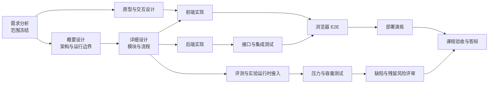

# 软件开发计划书

[TOC]

## 1 引言

### 1.1 标识

- 项目名称：AUBB（Academic Unified Builder Bench）一体化在线教学与实验平台
- 项目性质：课程大作业 / 软件工程项目开发
- 文档名称：AUBB 软件开发计划书
- 文档用途：用于指导 AUBB 平台从需求分析、方案设计、编码实现、联调测试到部署上线准备的全过程
- 适用范围：AUBB 平台首版建设周期内的软件研发活动

### 1.2 系统概述

为满足高校师生日益增长的在线教学与实训需求，计划开发一个名为 AUBB 的一体化在线教学与实验平台。该平台将面向教师与学生两类核心用户，围绕课程组织、作业管理、在线实验、自动评测、作业批改、成绩统计等教学活动提供统一支撑能力。

项目建设目标如下：

- 为教师提供课程管理、作业布置、实验发布、评测结果查看、批改与成绩统计能力，减轻重复性教学工作负担。
- 为学生提供随时随地可访问的在线学习、实验练习、作业提交、评测反馈与成绩查询环境。
- 在系统层面兼顾教学场景真实性、评测结果准确性和平台运行稳定性。

本项目的产品能力和交互体验吸收在线实验、自动评测和教学管理系统的常见做法，但本文不依赖读者访问外部平台即可理解项目计划。

本计划书仅覆盖软件研发与交付过程，不涉及合同、商务协议、采购、售后运维服务条款等非研发环节。

### 1.3 文档概述

本文档用于说明 AUBB 项目将如何开展软件开发工作，主要回答以下问题：

- 计划交付哪些软件成果和文档成果
- 项目范围、阶段目标和总体约束是什么
- 需求、设计、前后端实现、测试、部署和验收将如何组织
- 项目需要哪些人员、环境、工具和支持条件
- 项目可能面临哪些风险，以及如何提前控制

本文档面向课程教师、项目指导教师、项目组成员以及后续评审人员。文档中的技术路线、进度安排和资源估算用于指导项目实施，不作为商业合同承诺。

### 1.4 与其他计划之间的关系

本计划书是项目总控文档，负责说明“开发什么、怎么开发、何时交付、如何验收”。在项目推进过程中，还将配套形成如下文档：

- 软件需求规格说明书
- 总体设计说明书
- 详细设计说明书
- 数据库设计说明
- 接口说明 / OpenAPI 文档
- 测试计划与测试报告
- 部署方案与运行维护说明

上述文档将进一步细化本文中的相应章节，但不改变本计划书所确定的总体范围、阶段安排和管理原则。

### 1.5 基线

本项目开发计划的输入基线为：

1. 《课程大作业要求》中给出的项目建设目标和功能范围。
2. 同类教学平台的公开产品形态与业务流程观察，主要用于理解在线实验、自动评测和课程教学管理的常见做法。
3. 项目组对目标用户、教学业务流程和系统边界的统一理解。

## 2 编制依据与边界

本计划书按课程大作业要求、AUBB V1 产品目标和项目组统一范围制定。对同类教学平台的观察只用于启发业务流程，不作为本文读者必须访问的外部资料。

| 编号 | 依据 | 在本文中的体现 |
| ---- | ---- | -------------- |
| 1 | 课程大作业要求 | 明确项目目标、文档交付、演示验收和团队协作要求 |
| 2 | 在线实验平台常见流程 | 纳入实验发布、报告提交、环境型实验和 Web 终端能力 |
| 3 | 在线评测平台常见流程 | 纳入编程题、样例运行、正式评测、报告下载和重评能力 |
| 4 | 教学管理系统常见流程 | 纳入课程、教学班、成员、公告、资源、讨论、成绩发布能力 |

## 3 交付产品

### 3.1 程序

本项目计划交付以下程序类成果：

1. AUBB 平台前端应用
   - 教师端
   - 学生端
   - 管理员端
   - 基础登录与个人中心页面

2. AUBB 平台后端服务
   - 课程管理服务
   - 作业与题库管理服务
   - 实验与实验报告服务
   - 提交与自动评测服务
   - 批改、成绩统计与查询服务
   - 通知与审计支撑服务

3. 基础配套程序与运行资产
   - 数据库初始化与迁移脚本
   - 自动评测执行环境接入代码
   - 文件上传与对象存储接入代码
   - 日志、监控、健康检查相关程序
   - 部署脚本、镜像构建脚本与运行编排文件

### 3.2 文档

本项目计划交付以下文档成果：

1. 软件开发计划书
2. 软件需求规格说明书
3. 总体设计说明书
4. 详细设计说明书
5. 数据库设计说明
6. 接口文档 / OpenAPI 文档
7. 测试计划、测试用例与测试报告
8. 部署说明书
9. 使用说明或演示说明文档
10. 项目总结与验收材料

### 3.3 服务

本项目开发过程中涉及的服务性成果主要是研发过程中的协同支持，而不是商业售后服务，主要包括：

- 需求调研与需求澄清
- 原型评审与技术方案评审
- 前后端联调支持
- 测试环境搭建与演示支持
- 上线前部署演练与验收支持

### 3.4 非移交产品

以下内容属于开发过程中的中间产物，不作为最终交付成果：

- 开发人员个人临时脚本与本地调试记录
- 本地测试数据、测试账号和临时日志
- 中间版本原型草稿和未采用的技术方案
- 非正式会议记录和个人分析笔记

### 3.5 验收标准

本项目计划以“功能可用、流程完整、质量可验证、部署可执行”为核心验收原则。验收标准包括：

1. 功能层面

- 教师可完成课程创建、课程管理、作业布置、实验发布、批改和成绩查看。
- 学生可完成课程访问、实验操作、作业提交、评测结果查看和成绩查询。
- 平台具备课程管理、在线实验、自动评测、作业布置与批改、成绩统计等核心功能。

2. 流程层面

- 核心业务流程可闭环运行：
  - 登录 -> 课程 -> 作业/实验 -> 提交 -> 评测/批改 -> 成绩/通知
- 前后端联调完成，核心页面可驱动后端接口工作。

3. 质量层面

- 关键业务场景具备测试用例和测试结果记录。
- 自动评测结果具备正确性验证方案。
- 主要权限边界、异常场景和负向场景经过测试。

4. 交付层面

- 系统可在指定环境中完成部署。
- 具备基础运行文档、部署文档和测试报告。
- 具备演示和验收所需的完整环境与样例数据。

### 3.6 最后交付期限

本项目采用阶段性里程碑交付方式，不单独以商务合同节点表述最终交付期限。计划按照以下阶段推进：

- 阶段一：需求分析与范围冻结
- 阶段二：原型与总体设计
- 阶段三：前后端核心功能开发
- 阶段四：联调测试与系统完善
- 阶段五：部署准备与最终验收

各阶段的具体时间安排见第 7 章。

## 4 所需工作概述

本项目不是单一后端编码任务，而是一个覆盖需求、设计、前后端实现、测试、部署和验收准备的完整软件工程项目。所需工作主要包括以下方面。

### 4.1 需求分析工作

- 分析课程大作业要求，明确系统建设目标、用户角色和核心业务场景。
- 对教师与学生的典型使用流程进行梳理，形成用例和功能范围。
- 观察同类教学平台的常见流程，识别必须具备的基础能力与可延后实现的增强能力。
- 明确首版系统的边界，避免范围蔓延。

### 4.2 产品与交互设计工作

- 设计教师端与学生端的主要页面结构和交互流程。
- 明确课程、作业、实验、提交、评测、成绩等模块之间的用户路径。
- 形成前端页面原型与交互说明。
- 结合教学场景设计合理的操作反馈、错误提示和状态展示方式。

### 4.3 系统与架构设计工作

- 设计平台整体技术架构与模块划分。
- 设计前后端交互模式、接口规范和数据流。
- 设计数据库逻辑结构、主要实体关系和约束规则。
- 设计文件存储、自动评测、消息处理和系统监控等支撑能力。

### 4.4 前端开发工作

- 开发教师端与学生端的页面与组件。
- 对接登录、课程、作业、实验、提交、成绩和通知等接口。
- 完成表单校验、状态展示和交互反馈。
- 配合后端完成联调与兼容性修正。

### 4.5 后端开发工作

- 开发用户认证与权限控制能力。
- 开发课程管理、作业管理、实验管理、提交管理、自动评测、批改与成绩统计等服务。
- 提供稳定可复用的 REST API。
- 实现数据持久化、日志记录、异常处理、基础审计和系统监控接口。

### 4.6 联调与测试工作

- 完成前后端接口联调。
- 完成数据库、评测引擎、对象存储等真实依赖的接入验证。
- 开展单元测试、接口测试、集成测试、系统测试和验收测试。
- 重点验证权限边界、异常场景、评测正确性和系统稳定性。

### 4.7 部署与上线准备工作

- 设计开发、测试、演示和验收环境的部署方案。
- 准备镜像、配置文件、部署脚本和运行说明。
- 完成部署演练、回滚准备和运行检查。

### 4.8 主要需求与约束

本项目开发过程中需遵循以下约束：

- 系统必须服务于教师和学生两类核心用户。
- 系统必须覆盖课程管理、在线实验、自动评测、作业布置与批改、成绩统计等核心能力。
- 系统应强调教学场景真实性，不能只做静态信息展示。
- 评测结果必须具备可解释性和基本准确性保障。
- 系统应具备基本稳定性，避免在关键演示和验收时出现明显不可用问题。
- 项目重点放在需求到编码部署完成的研发过程，不扩展到合同、售后等非研发环节。

## 5 实施整个软件开发活动的计划

### 5.1 软件开发过程

本项目拟采用“需求分析 -> 方案设计 -> 分阶段开发 -> 联调测试 -> 部署验收”的迭代式开发过程。整体流程如下：

1. 需求分析阶段

- 解读课程大作业要求
- 明确用户角色、业务流程和首版范围
- 形成需求规格说明书

2. 方案设计阶段

- 完成原型设计、总体架构设计、数据库设计和接口设计
- 组织需求评审和设计评审
- 输出设计基线文档

3. 编码实现阶段

- 按模块并行推进前端与后端开发
- 优先实现主链路功能，再补充支撑功能和边界功能
- 逐步接入自动评测、文件上传、通知等外部支撑模块

4. 联调测试阶段

- 开展前后端联调
- 开展功能测试、接口测试、集成测试、权限测试和异常测试
- 修复问题并重复回归

5. 部署验收阶段

- 完成部署方案整理和环境准备
- 进行系统部署、演示验证和验收测试
- 形成最终交付材料

该过程将按迭代推进，每个迭代至少输出以下成果：

- 可运行的增量功能
- 对应文档更新
- 对应测试结果
- 已知问题与下一步计划

### 5.2 软件开发总体状态

#### 5.2.1 软件开发方法

本项目拟采用以下软件开发方法：

1. 需求驱动开发

- 以课程大作业要求为唯一直接需求来源。
- 所有功能设计都围绕教师和学生的真实教学场景展开。

2. 同类流程观察

- 吸收在线实验平台的实验组织和课程实践思路。
- 吸收在线评测平台的提交、判题和反馈思路。
- 吸收教学管理系统的课程组织和教学流程管理思路。
- 对标的目的是提炼可借鉴能力，不是直接照搬界面或功能细节。

3. 原型先行与迭代开发

- 先用原型明确主要页面、流程和模块边界。
- 再按优先级分阶段完成前后端开发。
- 每一阶段都形成可演示、可验证的中间成果。

4. 接口先行与并行协同

- 前后端开发通过接口文档和数据模型协同推进。
- 对外接口采用统一规范，减少联调返工。

5. 测试贯穿开发

- 在开发阶段同步准备测试用例。
- 对关键能力开展边开发边验证，避免将问题集中到末期。
- 对自动评测、权限控制、成绩统计等高风险模块重点验证。

6. 部署前置

- 开发过程中同步考虑环境依赖、配置管理和部署问题。
- 在进入验收前，必须具备可重复执行的部署方案。

为支撑上述方法，项目将使用以下工具与过程类别：

- 代码托管与版本管理工具
- 原型设计工具
- 前端开发框架与组件库
- 后端开发框架与数据库技术
- 自动评测引擎与文件存储服务
- 自动化测试工具
- 容器化部署与持续集成工具

#### 5.2.2 软件产品标准

本项目计划在需求、设计、编码、测试和文档环节建立统一标准。

1. 需求表达标准

- 所有需求应明确目标用户、业务场景、输入、输出和约束。
- 需求应区分核心功能与增强功能。
- 需求描述应尽量避免歧义，并可映射到测试用例。

2. 设计标准

- 系统设计需包含模块划分、数据流、主要实体关系和关键流程。
- 前端设计需给出页面结构、角色视图差异和交互说明。
- 后端设计需给出接口定义、数据模型、权限控制和异常处理方案。

3. 编码标准

- 代码命名应清晰、统一、语义化。
- 前端代码应遵循组件化、模块化原则。
- 后端代码应遵循分层设计原则，避免业务逻辑混杂。
- 公共能力应尽量复用，减少重复实现。
- 复杂逻辑应补充必要注释说明设计意图。

4. 接口标准

- API 风格保持统一。
- 请求参数、响应结构和错误信息需有统一规范。
- 接口文档应与实际实现同步更新。

5. 测试标准

- 功能测试应覆盖正常流程、异常流程和权限边界。
- 自动评测应覆盖正确答案、错误答案、运行异常和边界输入。
- 成绩相关功能应覆盖统计正确性、展示正确性和角色可见性。

6. 文档标准

- 文档应准确反映当前计划与实现目标。
- 阶段文档应与项目进展同步更新。
- 验收前必须形成可供评审的完整文档集。

#### 5.2.3 可重用的软件产品

##### 5.2.3.1 吸纳可重用的软件产品

本项目计划优先吸纳成熟、稳定的可重用软件产品和开源技术，以缩短开发周期、降低实现风险。重点考虑以下可重用方向：

- Web 开发框架
- 数据库与数据访问框架
- 对象存储组件
- 自动评测引擎
- 消息中间件
- 日志、监控和接口文档组件

吸纳原则如下：

- 优先选择成熟度高、资料完善、社区活跃的组件。
- 优先选择与项目规模相匹配、便于部署和演示的组件。
- 对引入组件进行适用性评估，确认其优点、局限与接入成本。
- 不为了技术复杂度而引入与项目目标无关的组件。

##### 5.2.3.2 开发可重用的软件产品

在项目开发过程中，也应主动沉淀可重用成果，为后续迭代和扩展提供基础。计划沉淀的内容包括：

- 通用页面组件与表单组件
- 统一接口封装与错误处理机制
- 通用权限校验逻辑
- 通用文件上传、评测请求和通知处理逻辑
- 通用部署脚本、配置模板和测试模板

项目组应在开发过程中识别哪些成果适合抽象为公共模块，并在不影响进度的前提下形成可复用资产。

#### 5.2.4 处理关键性请求

##### 5.2.4.1 安全性保证

本项目拟从以下方面保障系统安全性：

- 建立教师与学生的身份认证机制。
- 对不同角色设置明确的访问权限和操作边界。
- 对课程、作业、实验、提交和成绩等敏感资源进行权限控制。
- 对关键操作保留必要日志，便于追踪问题。
- 在部署阶段对账号、口令和配置文件进行安全管理。

##### 5.2.4.2 保密性保证

本项目主要关注技术开发过程中的保密性要求，具体包括：

- 开发过程中不在公开文档中暴露敏感账号和密钥。
- 测试数据与真实用户数据分离。
- 部署配置中的口令、密钥等敏感信息不写入源码仓库。

##### 5.2.4.3 私密性协议

本项目不单独制定法律意义上的隐私协议文本，但在系统设计中将遵守最小必要原则：

- 学生只能查看与本人有关的课程、提交、评测结果和成绩信息。
- 教师只能查看其管理范围内的教学数据。
- 成绩、实验报告和个人学习数据不得随意越权访问。

##### 5.2.4.4 其他关键性需求标准

除安全外，本项目还将重点保障以下关键性要求：

- 教学场景真实性：业务流程应符合真实课堂和实验教学场景。
- 评测准确性：评测流程和结果判定必须可验证、可解释。
- 系统稳定性：核心功能在验收环境中应稳定运行。
- 可部署性：系统应能完成独立部署和环境初始化。
- 可扩展性：模块划分应为后续功能扩展预留空间。

#### 5.2.5 计算机硬件资源利用

本项目预计需要以下计算机资源支持：

1. 开发资源

- 开发人员个人计算机
- 代码托管平台
- 原型设计与协作文档工具

2. 测试与联调资源

- 测试服务器或测试容器环境
- 数据库服务
- 评测引擎服务
- 文件存储服务

3. 演示与部署资源

- 演示环境服务器
- 镜像仓库或制品存储环境
- 运行时监控与日志查看环境

资源使用原则如下：

- 优先满足核心链路开发与测试需要。
- 开发、测试和演示环境尽量隔离。
- 对自动评测和文件处理等资源消耗较高的模块进行重点监控。

#### 5.2.6 记录原理

本项目中凡是会影响需求理解、系统架构、接口契约、数据结构、测试结论和部署方式的重要决策，都应进行记录。重点记录内容包括：

- 需求边界与范围调整
- 模块划分和技术路线选择
- 主要接口设计决策
- 数据模型和关键字段设计决策
- 自动评测策略和成绩统计规则
- 部署方案与环境依赖决策
- 风险问题及其处理结论

记录形式可包括：

- 需求说明文档
- 设计说明文档
- 接口文档
- 测试报告
- 会议纪要
- 问题单与版本说明

#### 5.2.7 需方评审途径

本项目中的评审对象主要包括课程指导教师、项目组内部成员以及后续验收人员。计划采用以下评审途径：

1. 需求评审

- 在需求分析完成后，确认系统范围、用户角色和功能边界。

2. 原型评审

- 在前端原型或页面设计形成后，确认主要流程和交互是否合理。

3. 技术方案评审

- 在总体设计完成后，评审模块划分、数据设计和接口方案。

4. 阶段成果评审

- 在每个开发阶段结束后，对已完成功能进行演示和问题复盘。

5. 验收评审

- 在联调、测试、部署准备完成后，对系统整体能力进行最终评审。

## 6 实施详细软件开发活动的计划

本章按课程项目全过程组织开发活动，说明每类活动的责任角色、主要输出和准出条件。活动之间的依赖关系在第 7 章用网络图说明。

### 6.1 项目计划和监督

| 活动 | 责任角色 | 主要输出 | 准出条件 |
| --- | --- | --- | --- |
| 软件开发计划维护 | 项目负责人 | 软件开发计划书、阶段目标、变更记录 | 范围、阶段、交付件和评审方式清晰 |
| CSCI 测试计划 | 测试负责人、后端负责人、前端负责人 | 模块测试、接口测试、集成测试范围 | 每个核心模块有对应测试类型和判定方式 |
| 系统测试计划 | 测试负责人 | 主链路、权限、部署、压力测试安排 | 功能验收和容量验收分开判定 |
| 软件安装计划 | 实施负责人 | 部署步骤、环境变量、初始化和回滚说明 | 新环境可按文档完成启动和冒烟 |
| 软件移交计划 | 项目负责人 | 交付材料清单、演示账号、版本说明 | 教师/助教可按材料复验系统 |
| 跟踪和更新 | 项目负责人 | 周进度、风险清单、缺陷状态 | 每周跟踪，关键节点完成评审 |

### 6.2 建立软件开发环境

| 环境项 | 计划安排 | 输出 |
| --- | --- | --- |
| 软件工程环境 | 前端、后端、文档分仓维护，统一状态检查和验证入口 | 可复验的开发工作区 |
| 软件测试环境 | 本地开发、集成测试、浏览器 E2E 和压力测试环境分层 | 可执行的测试与演示环境 |
| 软件开发库 | 源码、接口、过程文档和验证脚本按职责维护 | 版本化交付材料 |
| 软件开发文档 | 计划、需求、概要设计、详细设计、测试报告、部署文档、用户手册按阶段维护 | 可独立阅读的过程文档 |
| 非交付文件 | 本地调试文件、临时数据、真实凭据不纳入交付库 | 交付材料无敏感或临时内容 |

### 6.3 系统需求分析

| 活动 | 内容 | 输出 |
| --- | --- | --- |
| 用户输入分析 | 分析管理员、教师、助教、学员在教学管理、作业、评测、成绩、实验中的输入和反馈 | 角色场景、用例边界、输入输出约束 |
| 运行概念 | 梳理“建课 -> 发布任务 -> 学员提交 -> 评测/评阅 -> 成绩发布”的教学闭环 | 主业务流程图和运行模式说明 |
| 系统需求 | 形成编号化功能需求、非功能需求、数据需求和接口边界 | 需求规格说明书和验收矩阵 |

### 6.4 系统设计

| 活动 | 内容 | 输出 |
| --- | --- | --- |
| 系统设计决策 | 明确 Web 前端、后端服务、数据库、消息队列、对象存储、评测沙箱和实验运行时的职责 | 关键设计取舍 |
| 系统体系结构设计 | 设计表现层、接口层、应用/领域层、基础设施层和外部运行时关系 | 概要设计说明书、上下文图、部署视图 |

### 6.5 软件需求分析

软件需求分析以 V1 验收为边界，按功能组、角色、数据对象和质量属性拆分需求。输出应满足：

1. MUST 级需求可追踪到用例或验收活动。
2. SHOULD / COULD 级需求不会扩大首版必交付范围。
3. 容量、压力和可靠性需求单独列出，不与功能需求混写。

### 6.6 软件设计

| 活动 | 内容 | 输出 |
| --- | --- | --- |
| CSCI 级设计决策 | 按子系统说明模块职责、输入输出、状态流转和异常策略 | 详细设计说明书 |
| 系统体系结构设计 | 保持概要设计中的架构边界，并约束设计变更不破坏主链路 | 架构视图和接口边界 |
| CSCI 详细设计 | 对身份、课程、作业、提交、评测、成绩、实验、通知和审计等模块展开流程设计 | 状态机、时序图、界面入口和测试点 |

### 6.7 软件实现和配置项测试

| 活动 | 计划 | 记录方式 |
| --- | --- | --- |
| 软件实现 | 按模块完成前端页面、后端服务、数据库迁移、评测适配和实验运行时接入 | 版本记录和功能清单 |
| 配置项测试准备 | 为核心模块准备单元、接口、集成和浏览器用例 | 测试用例矩阵 |
| 配置项测试执行 | 每个模块变更后执行对应测试，关键链路执行回归 | 测试结果和缺陷记录 |
| 修改和再测试 | 缺陷修复后回归原失败用例及相邻主链路 | 回归记录 |
| 结果分析与记录 | 对失败项区分功能缺陷、环境问题、容量不足和文档偏差 | 测试报告和残留风险 |

### 6.8 配置项集成和测试

集成活动按“前后端接口 -> 中间件 -> 评测 -> 文件 -> 实验运行时 -> 浏览器主链路”顺序推进。通过条件为：

1. 前端能访问真实后端接口。
2. PostgreSQL、RabbitMQ、MinIO、Redis、go-judge 和实验运行时可连接。
3. 管理员、教师、学员主链路在真实浏览器中可闭环。
4. 集成失败项已记录责任范围和修复状态。

### 6.9 CSCI 合格性测试

| 项目 | 安排 |
| --- | --- |
| 独立性 | 由项目组自测、交叉复核和课程验收共同构成 |
| 测试环境 | 在本地真实前后端、集成依赖和演示环境中执行 |
| 测试准备 | 准备演示账号、课程、教学班、作业、实验和附件数据 |
| 测试演练 | 按管理员、教师、学员三类角色执行主链路 |
| 测试执行 | 覆盖功能、权限、异常、部署和压力测试 |
| 修改和再测试 | 对 P0/P1 缺陷执行修复后回归 |
| 结果记录 | 在测试报告中写明通过、失败、阻塞和残留风险 |

### 6.10 CSCI/HWCI 集成和测试

本项目不涉及专用硬件设备，不单独设置 HWCI。与硬件相关的内容按通用服务器、容器依赖和浏览器环境处理，验证重点是运行时依赖是否可启动、可访问、可清理。

### 6.11 系统合格性测试

系统合格性测试面向最终课程验收，准出条件如下：

| 准出项 | 判定 |
| --- | --- |
| 主链路 | 管理员、教师、学员完整演示链路通过 |
| 权限 | 跨角色、跨课程、跨教学班访问被正确拒绝 |
| 评测 | 真实 go-judge 提交、报告下载、重评和异常结果可验证 |
| 实验 | 报告型实验和 Kubernetes Web 终端实验可演示 |
| 压力 | 低并发演示稳定；高并发失败或阻塞项在报告中单独说明 |
| 部署 | 健康检查、构建和文档站构建通过 |

### 6.12 软件使用准备

| 准备项 | 输出 |
| --- | --- |
| 可执行软件 | 可运行的前端、后端和依赖服务组合 |
| 版本说明 | 本次交付范围、已知限制和验证结论 |
| 用户手册 | 管理员、教师、学员操作说明 |
| 用户现场安装 | 部署文档、环境变量、初始化步骤和冒烟清单 |

### 6.13 软件移交准备

移交材料包括源码、过程文档、部署说明、用户手册、测试报告、演示账号说明和残留风险清单。移交前应完成：

1. 源码和文档仓库状态干净。
2. 文档站构建通过。
3. 演示环境可启动并完成核心冒烟。
4. 未关闭的压力或功能问题已在测试报告中说明。

### 6.14 软件配置管理

| 活动 | 管理方式 |
| --- | --- |
| 配置标识 | 用版本号、提交记录、环境变量模板和交付清单标识配置项 |
| 配置控制 | 需求、接口、部署和测试口径变化需同步更新相关文档 |
| 配置状态统计 | 以仓库状态、提交记录、构建结果和测试结果统计 |
| 配置审核 | 发布或提交前检查变更范围、构建状态和敏感信息 |
| 发行管理和交付 | 按子仓库独立提交，交付时说明版本和验证结果 |

### 6.15 软件产品评估

产品评估按阶段进行：需求阶段评估范围完整性，设计阶段评估架构和模块边界，开发阶段评估主链路可用性，测试阶段评估缺陷和容量风险，验收阶段评估演示可复验性。评估记录进入测试报告、验收清单和阶段总结。

### 6.16 软件质量保证

| 质量活动 | 记录内容 |
| --- | --- |
| 质量评估 | 构建、测试、浏览器回归、压力测试、文档构建 |
| 质量记录 | 测试结果、缺陷状态、回归记录、残留风险 |
| 独立性 | 项目组自查、交叉审查和课程验收共同完成 |

### 6.17 问题解决过程（更正活动）

问题按“发现 -> 定级 -> 定责 -> 修复 -> 回归 -> 关闭 / 延期”处理。P0/P1 问题必须有明确回归证据；压力测试未执行项标为阻塞，指标不达标项标为失败。

### 6.18 联合评审

| 评审类型 | 评审内容 |
| --- | --- |
| 联合技术评审 | 需求、设计、接口、数据、评测、实验运行时、测试结论 |
| 联合管理评审 | 进度、分工、风险、交付清单、答辩准备 |

### 6.19 文档编制

过程文档按“计划、需求、概要设计、详细设计、测试报告”为主体，部署文档、用户手册和大模型使用说明作为支撑附录。每篇文档应能独立说明本文件负责的事实、结论和边界。

### 6.20 其他软件开发活动

| 活动 | 安排 |
| --- | --- |
| 风险管理 | 重点跟踪需求膨胀、真实评测运行时、Web 终端运行时、压力测试长尾、演示环境稳定性 |
| 软件管理指标 | 进度完成率、缺陷关闭率、测试通过率、构建通过率、压力测试通过/失败/阻塞状态 |
| 保密性和私密性 | 真实凭据、账号、token 和敏感数据不进入交付仓库 |
| 承包方管理 | 不适用 |
| IV&V 机构接口 | 不适用 |
| 开发方协调 | 前端、后端、测试、部署和文档成员按接口和里程碑协同 |
| 过程改进 | 阶段总结中记录问题原因、改进措施和下阶段调整 |
| 未提及活动 | 若出现新的课程验收要求，按变更流程纳入计划 |

## 7 进度表和活动网络图

### 7.1 建议进度表

结合课程项目的一般周期，建议按 16 周左右的节奏推进：

| 阶段   | 周期        | 主要活动                             | 主要输出                         |
| ------ | ----------- | ------------------------------------ | -------------------------------- |
| 阶段一 | 第 1-2 周   | 需求分析、竞品对标、范围冻结         | 需求说明、范围清单               |
| 阶段二 | 第 3-4 周   | 原型设计、总体设计、数据库与接口设计 | 原型、设计文档                   |
| 阶段三 | 第 5-8 周   | 前后端核心模块开发                   | 课程、作业、实验、登录等基础功能 |
| 阶段四 | 第 9-11 周  | 提交、自动评测、批改、成绩统计开发   | 核心教学主链路初版               |
| 阶段五 | 第 12-13 周 | 前后端联调、缺陷修复、系统完善       | 联调版本                         |
| 阶段六 | 第 14-15 周 | 系统测试、验收准备、部署演练         | 测试报告、部署方案               |
| 阶段七 | 第 16 周    | 演示验收、总结归档                   | 验收材料与项目总结               |

### 7.2 活动网络关系

项目活动的依赖关系如下：

其中关键路径主要集中在：

- 需求范围冻结
- 自动评测方案确定
- 前后端接口一致性
- 核心主链路联调
- 真实 go-judge 与 Web 终端运行时验证
- 压力测试失败 / 阻塞项说明
- 部署与验收环境准备

## 8 项目组织和资源

### 8.1 项目组织

建议项目组织结构如下：

| 角色            | 职责                                 |
| --------------- | ------------------------------------ |
| 项目负责人      | 统筹进度、组织评审、协调资源         |
| 需求/产品负责人 | 需求分析、范围控制、原型组织         |
| 前端开发成员    | 教师端、学生端页面与交互实现         |
| 后端开发成员    | 业务服务、接口、数据库、评测接入实现 |
| 测试成员        | 测试用例设计、联调验证、缺陷回归     |
| 部署/运维成员   | 环境搭建、部署脚本、运行检查         |

### 8.2 项目资源

项目预计需要如下资源。

1. 人力资源

- 项目负责人：1 人
- 需求/产品负责人：1 人
- 前端开发：1 至 2 人
- 后端开发：2 至 3 人
- 测试与验收支持：1 人
- 部署支持：1 人

2. 开发设施资源

- 开发计算机
- 代码仓库和协作工具
- 原型设计工具
- 测试与演示环境

3. 技术资源

- 数据库服务
- 对象存储服务
- 自动评测引擎
- 日志、监控和部署环境

4. 外部支持资源

- 指导教师评审意见
- 验收演示场景和业务样例

## 9 培训

### 9.1 项目的技术要求

项目组成员需要掌握以下方面的知识与技能：

- 软件工程基本过程和文档编制方法
- Web 系统前后端开发能力
- 数据库设计与接口设计能力
- 自动评测与在线实验场景的基本理解
- 联调、测试和部署的基本能力

### 9.2 培训计划

根据项目特点，建议开展以下轻量培训：

1. 业务培训

- 介绍教师端和学生端的典型使用场景
- 明确课程、作业、实验、提交、评测、成绩之间的关系

2. 技术培训

- 统一开发框架、接口规范和代码规范
- 统一数据库设计和联调方式

3. 测试与部署培训

- 统一测试流程
- 统一部署和演示流程

若项目组成员已具备上述基础能力，则培训可简化为集中说明和规范统一。

## 10 项目估算

### 10.1 估算规模

从功能范围看，本项目属于中等规模的教学类综合信息系统开发项目，涉及课程管理、实验平台、自动评测、成绩统计等多个业务子域。

### 10.2 工作量估算

建议以相对工作量估算：

- 需求分析与原型设计：15%
- 系统设计与数据库设计：15%
- 前端开发：20%
- 后端开发：30%
- 联调与测试：15%
- 部署与验收准备：5%

若按项目组 5 至 7 人参与估算，整个项目约需 18 至 24 人周工作量。

### 10.3 成本估算

本项目不做商业成本报价，成本估算主要用于内部资源安排，重点包括：

- 人力投入
- 测试与演示环境投入
- 存储、评测与运行环境投入

### 10.4 关键计算机资源估算

预计需要：

- 开发机若干
- 测试服务器或测试容器环境
- 数据库、评测服务和文件存储服务
- 演示部署环境

### 10.5 管理预留

建议保留 10% 至 15% 的进度预留，用于处理：

- 需求调整
- 评测链路复杂度超预期
- 联调返工
- 部署与验收前问题修复

## 11 风险管理

| 风险项             | 风险说明                             | 影响                 | 对策                                 |
| ------------------ | ------------------------------------ | -------------------- | ------------------------------------ |
| 需求边界不清       | 功能范围容易不断扩大                 | 进度延误             | 及早冻结首版范围，区分核心与增强功能 |
| 自动评测复杂度高   | 判题、运行环境和结果回写实现难度较高 | 核心链路受阻         | 提前验证评测方案，先实现最小闭环     |
| 前后端接口反复调整 | 原型、接口和实现不一致               | 联调返工             | 采用接口文档统一前后端协作           |
| 权限设计不清晰     | 教师、学生角色边界复杂               | 可能出现越权或误拒绝 | 在设计阶段明确角色权限矩阵           |
| 成绩统计口径出错   | 成绩汇总规则复杂                     | 影响系统可信度       | 对成绩规则建立专项测试与人工复核     |
| 部署环境不稳定     | 依赖环境搭建不完整                   | 演示与验收失败       | 提前准备部署脚本并进行部署演练       |
| 时间不足           | 功能点较多，课程项目周期有限         | 部分功能无法完成     | 按优先级实施，先保主链路             |

## 12 支持条件

### 12.1 计算机系统支持

项目开展需要以下基础支持：

- 开发计算机
- 代码管理和协作平台
- 测试环境
- 数据库服务
- 自动评测服务
- 文件存储服务
- 部署演示环境

### 12.2 需要需方承担的工作和提供的条件

对本项目而言，需方或指导方需要提供：

- 项目需求确认与范围评审
- 阶段成果反馈
- 验收标准确认
- 验收演示时间与条件支持

### 12.3 需要承包方承担的工作和提供的条件

对本项目而言，开发实施方需要承担：

- 系统分析、设计、编码、测试和部署准备
- 文档编写与版本管理
- 联调支持与问题修复
- 验收演示准备

## 13 注解

本文中的主要术语说明如下：

| 术语/缩略语 | 含义                                                 |
| ----------- | ---------------------------------------------------- |
| AUBB        | Academic Unified Builder Bench                       |
| SDP         | 软件开发计划                                         |
| API         | 应用程序接口                                         |
| UAT         | 用户验收测试                                         |
| 在线实验    | 学生通过浏览器访问并完成实验操作或实验报告的教学活动 |
| 自动评测    | 系统对提交内容进行自动运行、判定与反馈的能力         |
| 同类系统观察 | 用于理解业务形态和流程设计的常见做法                 |

本计划书中的“完整流程”是指从需求分析到设计、编码、测试、联调、部署和验收准备的全过程，不包括合同、采购、售后等非研发管理内容。

## 附录

### 附录 A 首版建议能力清单

建议首版优先实现以下能力：

1. 用户登录与角色区分
2. 课程创建与课程信息展示
3. 作业布置与作业列表
4. 在线实验入口与实验任务管理
5. 学生提交与自动评测
6. 教师批改与成绩统计
7. 学生成绩查询
8. 基础通知与结果反馈

### 附录 B 后续可扩展方向

在首版完成后，可进一步扩展：

- 更丰富的实验模板
- 更复杂的判题策略
- 更精细的成绩分析
- 更完整的教学数据统计
- 更多终端和消息通知形式
