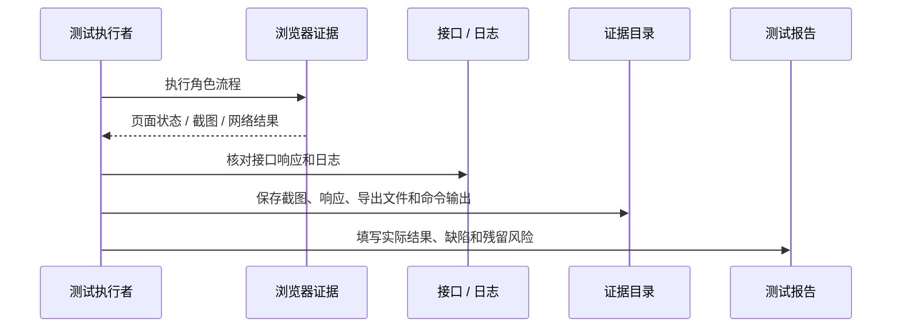

# 测试报告

## 1 引言

### 1.1 目标

本文档定义 AUBB V1 验收阶段的测试范围、测试方法、执行记录格式和通过准则。本文不替代详细测试策略，也不复述需求和设计细节；它负责把“测什么、怎么判定、证据放在哪里”说明清楚。

### 1.2 背景

AUBB 是一体化在线教学与实验平台，测试重点放在真实教学主链路、权限隔离、评测准确性、成绩发布可见性、实验运行和部署可复验性。

### 1.3 范围

| 范围 | 覆盖内容 |
| --- | --- |
| 功能测试 | 登录、平台治理、课程、作业、提交、判题、批改、成绩、实验、通知 |
| 接口测试 | 稳定 REST API、WebSocket 终端入口、错误码和权限边界 |
| 集成测试 | PostgreSQL、RabbitMQ、MinIO、Redis、go-judge、实验运行时 |
| 浏览器 E2E | 管理员、教师、助教、学员关键页面和主链路 |
| 非功能验证 | 响应时间、降级提示、审计留痕、健康检查和文档构建 |

### 1.4 引用文件

| 文件 | 用途 |
| --- | --- |
| 《软件需求规格说明书》 | 功能与非功能验收来源 |
| 《软件概要设计说明书》 | 架构与模块边界 |
| 《软件详细设计说明书》 | 状态机、接口边界和异常处理 |
| 《部署文档》 | 环境准备和部署验证步骤 |
| server 稳定接口清单 | API 范围和契约核对 |

## 2 测试计划

### 2.1 目的

测试计划用于确认系统是否满足以下准入条件：

1. MUST 级需求没有阻断性交付缺陷。
2. 核心教学链路可在真实浏览器和真实后端环境中闭环。
3. go-judge、RabbitMQ、对象存储和实验运行时相关能力有真实集成证据。
4. 权限、成绩、审计和导出等高风险能力可复查。

### 2.2 测试项

| 测试项 | 主要对象 | 通过标志 |
| --- | --- | --- |
| 认证与授权 | 登录、刷新、退出、会话撤销、401/403 | 越权访问被拒绝，合法角色可访问授权资源 |
| 平台治理 | 平台配置、组织、用户、权限解释、审计 | 数据写入后可查询，关键操作有审计 |
| 课程与作业 | 课程、教学班、成员、公告、资源、讨论、作业 | 教师可管理，学员只能看到授权范围 |
| 提交与评测 | 工作区、附件、正式提交、样例运行、评测报告 | 提交可追踪，评测进入终态，报告可查看或下载 |
| 批改与成绩 | 人工评分、批量调整、成绩发布、成绩册 | 发布前后学员可见性符合规则 |
| 实验 | 报告型实验、终端实验、附件、会话 | 报告可提交，终端会话按运行时配置可启动和停止 |
| 通知 | 通知列表、未读数、SSE 增量、已读 | 关键事件产生通知，断线后可轮询恢复 |
| 部署与文档 | 健康检查、构建、部署步骤、过程文档 | 命令可执行，文档站构建通过 |

### 2.3 不测试的特征

| 不测试项 | 原因 |
| --- | --- |
| 商业计费、合同和开票 | 不在 V1 范围 |
| 原生移动端和离线客户端 | 不在 V1 范围 |
| 邮件、短信、企业 IM 发送 | 当前只承诺站内通知和可扩展边界 |
| VNC/RDP/noVNC/教师接管终端 | 环境型实验不覆盖这些高级运行时能力 |
| AI 自动讲解、查重和作弊识别 | 不在当前验收主链路 |

### 2.4 测试方法

- 单元测试覆盖状态机、权限策略、数据映射和前端共享逻辑。
- 集成测试覆盖数据库、对象存储、消息队列、go-judge 和实验会话。
- 浏览器 E2E 以 Playwright MCP 操作真实页面作为主证据。
- 命令门禁用于验证构建、类型、文档和非浏览器测试。

### 2.5 通过准则

| 级别 | 准则 |
| --- | --- |
| P0 | 主链路阻断、数据泄露、评测或成绩严重错误，必须关闭后验收 |
| P1 | 影响关键角色工作流但有临时绕行方案，应在本轮修复或明确批准延期 |
| P2 | 局部体验、文案或低频异常问题，可进入残留风险 |
| P3 | 不影响验收的建议项，记录为后续优化 |

## 3 测试设计说明

### 3.1 测试环境基线

| 项目 | 基线 |
| --- | --- |
| 前端 | Next.js 16 + React 19，默认端口 `3000` |
| 后端 | Spring Boot 4 + Java 25，默认端口 `18080` |
| 数据库 | PostgreSQL 16 |
| 队列 | RabbitMQ，含评测队列和 DLQ |
| 对象存储 | MinIO / S3 兼容服务 |
| 缓存 / 限流 | Redis 7，可按配置启用 |
| 判题 | go-judge |
| 浏览器 | Chrome、Edge、Firefox 最新两个主要版本 |

### 3.2 证据链设计

## 4 测试用例说明

| 用例编号 | 用例名称 | 预期结果 | 实际结果 | 结论 |
| --- | --- | --- | --- | --- |
| TC-AUTH-01 | 教师登录成功 | 成功进入教师工作台，当前用户信息正确 | 执行后补证 | 执行后判定 |
| TC-AUTH-02 | 学员越权访问管理员页面 | 返回 403 或无权限页 | 执行后补证 | 执行后判定 |
| TC-ADM-01 | 用户导入与审计 | 返回导入结果，关键操作可在审计中查询 | 执行后补证 | 执行后判定 |
| TC-CRS-01 | 创建课程、教学班和成员 | 教师与学员只能看到授权课程范围 | 执行后补证 | 执行后判定 |
| TC-ASG-01 | 发布结构化编程作业 | 学员可看到题目、规则和在线 IDE 入口 | 执行后补证 | 执行后判定 |
| TC-SUB-01 | 工作区保存、试运行和正式提交 | 试运行有结果，整份作业提交生成提交记录 | 执行后补证 | 执行后判定 |
| TC-JDG-01 | 自动评测成功 | 评测进入终态，报告可查看或下载 | 执行后补证 | 执行后判定 |
| TC-JDG-02 | go-judge 或队列异常 | 提交不丢失，评测失败有明确状态和恢复入口 | 执行后补证 | 执行后判定 |
| TC-GRD-01 | 人工评分和成绩发布 | 发布后学员可查看成绩和反馈 | 执行后补证 | 执行后判定 |
| TC-LAB-01 | 报告型实验提交与评阅 | 学员可提交报告，教师可评阅并发布评语 | 执行后补证 | 执行后判定 |
| TC-LAB-02 | 终端实验会话 | 学员可获取短期 token 并连接 Web 终端 | 执行后补证 | 执行后判定 |
| TC-NTF-01 | 通知列表与未读数 | 关键事件产生通知，已读状态可更新 | 执行后补证 | 执行后判定 |
| TC-OPS-01 | 部署冒烟和健康检查 | readiness、前端访问和文档构建通过 | 执行后补证 | 执行后判定 |

## 5 测试规程说明

### 5.1 命令规程

| 目的 | 命令 |
| --- | --- |
| 工作区状态 | `just status` |
| 健康检查 | `just healthcheck` |
| 快速门禁 | `just verify` |
| 完整门禁 | `just verify-full` |
| 真实浏览器 E2E | `just e2e-real` |
| 文档站构建 | `cd docs && npm run docs:build` |

### 5.2 角色流程规程

1. 管理员完成平台配置、组织、用户和权限解释检查。
2. 教师创建课程、教学班、成员、课程内容和作业。
3. 学员查看课程，完成在线 IDE 保存、试运行和正式提交。
4. 系统完成评测，教师查看提交、批改并发布成绩。
5. 学员查看成绩、通知和反馈。
6. 对实验链路单独执行报告型实验或终端实验验证。

## 6 测试日志

| 执行时间 | 环境 | 命令或用例 | 证据位置 | 结果 | 备注 |
| --- | --- | --- | --- | --- | --- |
| 执行后补充 | 本地 / 预发 | 执行后补充 | 执行后补充 | 执行后判定 | 执行后补充 |

## 7 缺陷记录

| 缺陷编号 | 描述 | 严重级别 | 状态 | 责任范围 |
| --- | --- | --- | --- | --- |
| 执行后补充 | 执行中发现的问题现象、触发步骤和期望差异 | P0/P1/P2/P3 | 新增 / 修复中 / 已关闭 / 延期 | 前端 / 后端 / 文档 / 环境 |

## 8 测试总结报告

验收前至少满足：

1. P0 缺陷全部关闭。
2. 主链路用例和权限边界用例通过。
3. 关键证据已归档，包括浏览器截图、接口响应、命令输出、日志片段和导出文件。
4. 部署文档经全新环境或等价环境复验。
5. 残留风险已说明影响范围、绕行方案和后续处理责任。
