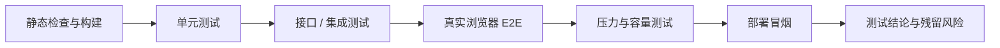
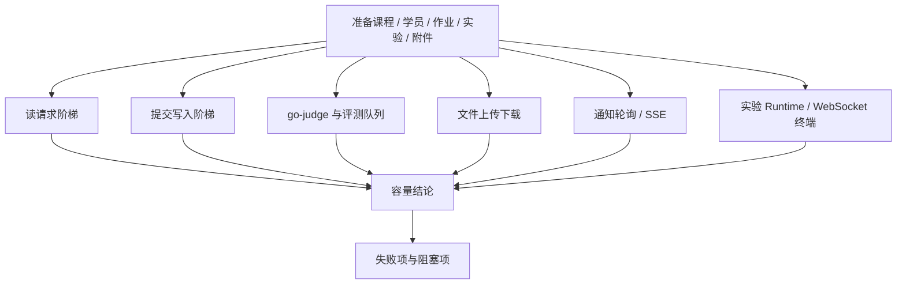

# 测试报告

## 1 引言

### 1.1 目标

本文档记录 AUBB V1 课程交付阶段的测试范围、测试方法、执行结果、压力测试结论、缺陷状态和残留风险。本文为独立测试报告，正文直接给出验收所需的关键事实，不要求评审人员再跳转阅读其他文档才能理解结论。

### 1.2 被测系统

AUBB 是一体化在线教学与实验平台，V1 被测能力包括平台治理、课程教学、作业提交、自动评测、人工批改、成绩发布、通知、报告型实验和 Web 终端实验。

| 类别 | 被测对象 |
| --- | --- |
| 前端 | Next.js 16、React 19、TypeScript、Tailwind CSS 4，默认访问端口 `3000` |
| 后端 | Spring Boot 4、Java 25，工作区本地开发端口 `18080` |
| 数据与中间件 | PostgreSQL 16、RabbitMQ、MinIO、Redis |
| 评测运行时 | go-judge，RabbitMQ 评测队列，独立评测消费进程 |
| 实验运行时 | Fake Runtime 用于本地演示；Kubernetes Runtime 用于真实 Web 终端实验 |
| 浏览器 | 以桌面端 Chrome / Chromium 实际页面为主要验收对象 |

### 1.3 测试范围

| 范围 | 覆盖内容 | 结论口径 |
| --- | --- | --- |
| 功能测试 | 登录、平台治理、课程、作业、提交、判题、批改、成绩、实验、通知 | 通过 / 失败 |
| 接口与集成测试 | REST API、WebSocket 终端入口、错误码、权限边界、中间件集成 | 通过 / 失败 |
| 浏览器 E2E | 管理员、教师、助教、学员关键页面和主链路 | 通过 / 失败 |
| 压力与容量测试 | 读请求、写提交、go-judge、文件、通知/SSE、Web 终端、soak 稳定性 | 通过 / 失败 / 阻塞 |
| 部署与文档验证 | 健康检查、构建、文档站构建、演示环境冒烟 | 通过 / 失败 |

### 1.4 不测试范围

| 不测试项 | 原因 |
| --- | --- |
| 商业计费、合同和开票 | 不属于课程大作业 V1 范围 |
| 原生移动端和离线客户端 | V1 以桌面浏览器教学工作台为验收对象 |
| 邮件、短信、企业 IM 发送 | V1 只承诺站内通知与可扩展边界 |
| VNC/RDP/noVNC/教师接管终端 | 环境型实验只覆盖浏览器 Web 终端 |
| AI 自动讲解、查重和作弊识别 | 不属于当前核心验收链路 |
| 生产环境压测 | 本轮只对本地真实前后端与本地依赖做容量验证 |

## 2 测试计划

### 2.1 测试目的

测试计划用于确认系统是否满足以下准入条件：

1. 核心教学主链路可在真实浏览器和真实后端环境中闭环。
2. go-judge、RabbitMQ、对象存储和实验运行时相关能力有真实集成结果。
3. 权限、成绩、审计、导入导出和附件等高风险能力可复查。
4. 压力测试能说明系统在小并发演示、专项容量和高并发边界下的实际状态。
5. 压力测试只证明容量和稳定性，不替代功能验收；功能通过与容量通过必须分开判定。

### 2.2 测试方法

| 方法 | 说明 |
| --- | --- |
| 静态检查与构建 | 验证类型、依赖、生产构建和文档构建是否可通过 |
| 单元测试 | 覆盖领域规则、状态流转、权限策略和前端共享逻辑 |
| 接口 / 集成测试 | 覆盖数据库、队列、对象存储、go-judge、实验会话和通知 |
| 真实浏览器 E2E | 按角色操作页面，验证主链路、权限边界和页面状态 |
| 压力与容量测试 | 按并发阶梯采集响应时间、错误率、5xx、队列和资源指标 |
| 部署冒烟 | 验证本地演示环境可启动、可访问、可完成核心链路 |

### 2.3 通过准则

| 级别 | 准则 |
| --- | --- |
| P0 | 主链路阻断、数据泄露、评测或成绩严重错误，必须关闭后验收 |
| P1 | 影响关键角色工作流或容量目标，应在本轮修复或明确列入阻塞项 |
| P2 | 局部体验、文案或低频异常问题，可进入残留风险 |
| P3 | 不影响验收的建议项，记录为后续优化 |

压力测试结果不得使用“未覆盖”模糊收口。未执行的必测压力项必须标为“阻塞”，实际不达标的压力项必须标为“失败”。

## 3 测试设计说明

### 3.1 环境基线

| 项目 | 基线 |
| --- | --- |
| 测试日期 | 2026-06-11 至 2026-06-12 |
| 测试环境 | 本地真实前后端、本地 Docker 依赖、本地浏览器 |
| 前端地址 | `http://127.0.0.1:3000` |
| 后端地址 | `http://127.0.0.1:18080` |
| 机器摘要 | 8 CPU、16 GiB 内存、macOS，本地 Docker 运行依赖服务 |
| 实验运行时 | 基础压测使用 Fake Runtime；Web 终端专项使用 Kubernetes Runtime |
| 数据准备 | 平台管理员、教师、学员、课程、教学班、作业、实验、提交附件和实验附件 |

### 3.2 功能测试设计

| 用例编号 | 用例名称 | 输入 / 前置条件 | 预期输出 | 实际结果 | 结论 |
| --- | --- | --- | --- | --- | --- |
| TC-AUTH-01 | 教师登录成功 | 有效教师账号 | 进入教师工作台，当前用户信息正确 | 真实浏览器登录通过 | 通过 |
| TC-AUTH-02 | 学员越权访问管理员页面 | 有效学员账号访问管理员入口 | 返回无权限页或 `403` | 越权被拦截 | 通过 |
| TC-ADM-01 | 用户导入与审计 | CSV 用户数据、管理员账号 | 返回导入结果，关键操作产生审计记录 | 用户导入和审计查询通过 | 通过 |
| TC-CRS-01 | 创建课程、教学班和成员 | 教师账号、课程和学员数据 | 教师与学员只能看到授权课程范围 | 课程和成员主链路通过 | 通过 |
| TC-ASG-01 | 发布结构化编程作业 | 教师账号、题目与评分规则 | 学员可看到作业、题目和在线 IDE 入口 | 作业发布和学员可见性通过 | 通过 |
| TC-SUB-01 | 在线工作区保存与整份作业提交 | 学员进入编程题工作区 | 工作区可保存；整份提交在作业详情页生成记录 | 保存、返回、正式提交通过 | 通过 |
| TC-JDG-01 | 自动评测成功 | 编程题正式提交 | 评测进入终态，报告可查看或下载 | go-judge 真实链路通过 | 通过 |
| TC-JDG-02 | 评测异常与重评 | 错误代码、重评请求 | 失败状态清晰，重评可进入队列 | 五类结果和重评通过 | 通过 |
| TC-GRD-01 | 人工评分和成绩发布 | 教师批改提交并发布 | 学员发布后可查看成绩和反馈 | 成绩发布链路通过 | 通过 |
| TC-LAB-01 | 报告型实验提交与评阅 | 学员提交实验报告 | 教师可评阅，学员可查看反馈 | 基础实验链路通过 | 通过 |
| TC-LAB-02 | Web 终端实验会话 | Kubernetes Runtime 可用 | 学员获得短期 token，连接 Web 终端，停止后清理资源 | 真实 Kubernetes Web 终端通过 | 通过 |
| TC-NTF-01 | 通知列表与未读数 | 触发关键教学事件 | 通知产生，未读数可更新，断线可轮询恢复 | 通知轮询通过；SSE 高并发仍需补测 | 部分通过 |
| TC-OPS-01 | 部署冒烟和健康检查 | 本地依赖、前后端启动 | readiness、前端访问和文档构建通过 | 健康检查、E2E、构建通过 | 通过 |

### 3.3 压力测试设计

压力测试覆盖核心 API 读请求、写提交、评测轮询、真实 go-judge、文件上传下载、通知、SSE、实验运行时、Kubernetes Web 终端和 soak 稳定性。

| 指标 | 判定方式 |
| --- | --- |
| 响应时间 | 记录平均值、P95、P99；关键读请求严格阈值为 P95 < 500ms、P99 < 1500ms |
| 错误率 | 压力阶段总错误率应低于 1%；关键专项要求 5xx 为 0 |
| 写入容量 | 正式提交、文件上传、重评等写入请求应无 5xx、无误触发限流 |
| 评测容量 | go-judge sample-run、正式提交、报告下载、重评均能进入终态 |
| Web 终端容量 | Kubernetes WebSocket 初连、命令 I/O、重连、重置、停止清理均成功 |
| 稳定性 | soak 阶段验证长时间混合流量下错误率、5xx、资源清理和健康检查 |

## 4 测试用例说明

### 4.1 主链路用例结果

| 主链路 | 覆盖角色 | 关键步骤 | 实际结果 | 结论 |
| --- | --- | --- | --- | --- |
| 平台初始化 | 管理员 | 平台配置、组织、用户、权限解释、审计 | 管理入口可用，权限与审计可查询 | 通过 |
| 教学组织 | 教师 / 助教 | 建课、建班、成员、公告、资源、讨论 | 教师课程工作区和课程上下文入口可完成教学组织 | 通过 |
| 作业发布 | 教师 | 创建作业、编辑题目、配置判题环境、发布 | 学员可在授权范围查看作业 | 通过 |
| 学员提交 | 学员 | 查看作业、在线 IDE 保存、返回作业详情、正式提交 | 工作区保存与整份提交边界清晰 | 通过 |
| 自动评测 | 系统 / 教师 / 学员 | 入队、go-judge 执行、报告生成、下载 | 真实 go-judge 链路通过 | 通过 |
| 批改成绩 | 教师 / 学员 | 人工评分、成绩发布、学员查看 | 发布前后可见性符合规则 | 通过 |
| 实验链路 | 教师 / 学员 | 发布实验、提交报告或启动 Web 终端、评阅 | 报告型实验和终端实验主流程可用 | 通过 |
| 通知链路 | 全角色 | 事件产生、通知列表、未读数、轮询恢复 | 轮询链路通过；SSE 高并发专项阻塞 | 部分通过 |

### 4.2 压力测试结果

| 场景编号 | 压力场景 | 并发 / 时长 | 关键结果 | 结论 |
| --- | --- | --- | --- | --- |
| PERF-01 | 公共入口、认证与基础读请求 | 50 / 200 / 500 / 1000 并发 | 错误率 0、5xx=0；P95 为 18.31ms / 224.38ms / 2346.07ms / 2713.40ms，P99 为 34.57ms / 2283.08ms / 2777.94ms / 3160.52ms | 失败：500/1000 长尾超过严格阈值 |
| PERF-02 | 学员提交写路径 | 10 / 30 / 50 / 100 并发 | 错误率 0、5xx=0、429=0；100 并发总体 P95 73.47ms，提交端点 P95 94.35ms | 通过 |
| PERF-03 | 评测轮询 | 50 / 200 / 500 并发 | 错误率 0、5xx=0 | 通过 |
| PERF-04 | 真实 go-judge sample-run | 5 / 10 / 20 并发，各 120 秒 | 三档错误率 0、5xx=0 | 通过 |
| PERF-05 | 真实 go-judge 正式提交链路 | 5 / 10 / 20 并发，各 300 秒 | 提交数 916 / 1646 / 2060，错误率 0、5xx=0，学生与教师报告下载成功 | 通过 |
| PERF-06 | go-judge 重评 | 5 / 10 并发，各 120 秒 | 创建 380 / 640 个重评任务，错误率 0、5xx=0 | 通过 |
| PERF-07 | 文件上传 | 5 / 10 / 20 并发 | 三档文件上传均返回 201，覆盖 64KiB、1MiB、20MiB | 通过 |
| PERF-08 | 文件下载 | 20 / 100 / 300 并发 | 下载 300 阶段 42472 次请求全 200、5xx=0 | 通过；权限负例和 MinIO 指标仍阻塞 |
| PERF-09 | 通知轮询 | 50 / 200 / 500 并发 | 错误率 0、5xx=0，500 并发 P95 71.38ms | 通过 |
| PERF-10 | SSE 长连接 | 20 并发 1 分钟；100 / 300 并发未执行 | 20 并发错误率 0；100 / 300 长连接保持尚未执行 | 阻塞 |
| PERF-11 | Fake 实验运行时 | 10 并发 1 分钟 | P95 45.6ms、5xx=0 | 通过 |
| PERF-12 | Kubernetes Web 终端 | 5 / 10 / 20 并发，各 600 秒 | 错误率 0、5xx=0，初连、命令 I/O、重连、重置和停止清理成功，Pod 重启 0 | 通过 |
| PERF-13 | 10 分钟 smoke soak | 100 并发 600 秒 | 384751 次请求，RPS 640.96，P95 20.36ms，P99 54.17ms，错误率 0、5xx=0 | 通过 |
| PERF-14 | 30 分钟合同 soak | 100 并发 1800 秒 | runner 已具备执行能力，但该阶段未完成实测 | 阻塞 |

### 4.3 压力测试总结

| 结论项 | 说明 |
| --- | --- |
| 总体结论 | 不通过全平台合同容量目标 |
| 已证明能力 | 写提交、评测轮询、真实 go-judge、文件上传下载容量、通知轮询、Fake Runtime、真实 Kubernetes Web 终端、10 分钟 smoke soak |
| 失败能力 | 500/1000 并发基础读请求长尾超过严格 P95/P99 阈值 |
| 阻塞能力 | SSE 100/300 长连接、30 分钟 soak、文件权限负例、MinIO 指标、部分管理/课程/题库/成绩/权限/前端专项压力阶梯 |
| 交付口径 | 可用于低并发课程演示和功能验收说明；不能宣称通过全平台高并发容量验收 |

## 5 测试规程说明

### 5.1 命令规程

| 目的 | 命令 | 本轮结果 |
| --- | --- | --- |
| 工作区状态 | `just status` | server、web、docs 均保持干净后进入测试 |
| 健康检查 | `just healthcheck` / 严格健康检查 | 通过 |
| 快速门禁 | `just verify` | 通过 |
| 完整门禁 | `just verify-full` | 通过 |
| 真实浏览器 E2E | `just e2e-real` | 50 个用例通过 |
| 文档站构建 | `cd docs && npm run docs:build` | 通过，保留既有 chunk size warning |
| 压力测试 | 合同 profile 压力脚本与专项脚本 | 部分通过，整体容量目标不通过 |

### 5.2 角色流程规程

1. 管理员完成平台配置、组织、用户、权限解释和审计检查。
2. 教师创建课程、教学班、成员、课程内容和作业。
3. 学员查看课程，进入在线 IDE 保存、试运行，并在作业详情页提交整份作业。
4. 系统完成评测，教师查看提交、批改并发布成绩。
5. 学员查看成绩、通知和反馈。
6. 对报告型实验和终端实验分别执行实验提交、评阅、Web 终端启动和资源清理验证。
7. 对压力测试失败或阻塞项单独记录，不用功能通过结论覆盖容量结论。

## 6 测试日志摘要

| 日期 | 环境 | 测试内容 | 结果 | 备注 |
| --- | --- | --- | --- | --- |
| 2026-06-11 | 本地真实前后端 | 真实浏览器 E2E | 通过 | 50 个 E2E 用例通过 |
| 2026-06-11 | 本地真实前后端 | 快速门禁 | 通过 | 后端测试、前端 lint/typecheck、文档构建通过 |
| 2026-06-11 | 本地真实前后端 | 完整门禁 | 通过 | 后端测试、前端测试、生产构建、文档构建通过 |
| 2026-06-12 | 本地真实前后端 | 读请求与写路径修复后复测 | 部分通过 | 5xx 清零；读请求 500/1000 长尾仍不达标 |
| 2026-06-12 | Kubernetes Runtime | Web 终端单会话与并发专项 | 通过 | 5/10/20 并发各 10 分钟通过 |
| 2026-06-12 | go-judge | sample-run、正式提交、报告下载、重评 | 通过 | 五类评测结果完成覆盖 |
| 2026-06-12 | MinIO / 文件链路 | 文件上传下载矩阵 | 部分通过 | 容量链路 5xx 清零；权限负例与指标仍阻塞 |
| 2026-06-12 | 本地真实前后端 | 10 分钟 smoke soak | 通过 | 100 并发、错误率 0、5xx=0 |
| 2026-06-12 | 本地真实前后端 | 30 分钟合同 soak | 阻塞 | 未完成实测 |

## 7 缺陷与残留风险

| 编号 | 描述 | 严重级别 | 状态 | 影响 |
| --- | --- | --- | --- | --- |
| TR-PERF-01 | 500/1000 并发基础读请求 P95/P99 超过严格阈值 | P1 | 未关闭 | 不能宣称全平台高并发容量通过 |
| TR-PERF-02 | SSE 100/300 长连接保持未完成实测 | P1 | 阻塞 | 实时通知高并发容量结论不足 |
| TR-PERF-03 | 30 分钟合同 soak 未完成实测 | P1 | 阻塞 | 长时混合流量稳定性证据不足 |
| TR-PERF-04 | 文件权限负例、MinIO 指标和 gradebook 导出/报告长尾未关闭 | P1 | 阻塞 | 文件与报表专项容量仍需补证 |
| TR-PERF-05 | 管理、课程、题库、成绩、权限和前端静态资源专项压力阶梯未完全执行 | P2 | 阻塞 | 容量矩阵仍不完整 |
| TR-OBS-01 | Kubernetes Metrics API 不可用，未记录 Web 终端 CPU / 内存曲线 | P2 | 残留 | 不影响 Web 终端功能通过，但影响资源观测完整性 |

## 8 测试总结报告

1. 功能验收主链路通过：管理员、教师、学员、作业、提交、评测、成绩、实验和通知主流程可完成。
2. 真实 go-judge 通过：sample-run、正式提交、五类结果、报告下载和重评均有通过结果。
3. 真实 Kubernetes Web 终端通过：单会话、5/10/20 并发、WebSocket 命令 I/O、重连、重置和停止清理均通过。
4. 压力测试总体不通过全平台合同容量目标：读请求 500/1000 长尾超阈值，SSE 100/300、30 分钟 soak 和若干专项仍阻塞。
5. 当前系统可用于课程大作业低并发演示和功能答辩；若要声明高并发容量达标，必须先关闭第 7 章列出的 P1 压力测试缺口。
